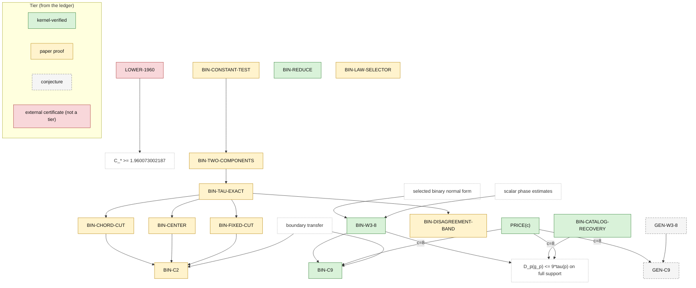

# Claim DAG and status ledger

This is the current status record. Each claim has its exact scope and evidence
below. [Lean contracts](lean-contracts.md) separate existing declarations from
future targets; [admissions](../verification/admissions.md) record the local
audits and their history.

## Status vocabulary

| Status | Meaning |
|---|---|
| `kernel-verified` | Lean compiled with no unfinished proof dependency, and its exact axiom set was audited. The repository in which this occurred is named. |
| `paper proof` | Complete rigorous prose derivation with no unresolved step; not formalized. |
| `conjecture` | Unresolved mathematical claim. |

External-source labels identify where and how evidence was checked. They are
qualifiers, not additional tiers. A composite proof inherits the weakest tier
of the inputs it needs.

## Dependencies

```text
selected binary normal form + scalar phase estimates --> BIN-W3-8
BIN-W3-8 + PRICE(8) + boundary transfer ----------------> BIN-C9
BIN-W3-8 + BIN-CATALOG-RECOVERY + PRICE(8) -------------> D_p(g_p) <= 9*tau(p) on full support

PRICE(8) + GEN-W3-8 ---------------------------> GEN-C9

LOWER-1960 ------------------------------------> C_* >= 1.960073002187

BIN-CONSTANT-TEST -----------------------------> BIN-TWO-COMPONENTS
BIN-TWO-COMPONENTS ----------------------------> BIN-TAU-EXACT
BIN-TAU-EXACT ---------------------------------> BIN-DISAGREEMENT-BAND
BIN-TAU-EXACT ---------------------------------> BIN-CHORD-CUT
BIN-TAU-EXACT ---------------------------------> BIN-CENTER
BIN-TAU-EXACT ---------------------------------> BIN-FIXED-CUT
BIN-CHORD-CUT + BIN-CENTER + BIN-FIXED-CUT + boundary transfer ---> BIN-C2
```

The binary stochastic-optimum rows supply the right-hand side of `BIN-C2`. The
three factor-two rows compare that value with $`T`$ along each contact chord,
and the boundary transfer, the same kernel-verified
`T_le_mul_tau_of_forall_fullSupport` that FactorNine uses, extends the bound to
laws with zero cells at constant two.

The same dependencies as a diagram, with the ledger tier as node colour;
regenerate it with `scripts/gen_diagrams.py` whenever the picture above or
the ledger table changes:



C9 bounds a selected chart code directly; its numerical upper bound does not
need the separate minimality theorem `BIN-REDUCE`, which therefore has no edge
above. Catalog recovery also bounds the mathematical law-only selector $`g_p`$
on full support (the third line; the endpoint is
`Binary.detScore_selector_le_nine_mul_tau_of_fullSupport`). `BIN-LAW-SELECTOR`
defines that selector and records the open executable contract; it is a
definition consumed by the third line, not a numerical claim.

`BIN-C2` is the binary constant two, at `paper proof`. Its inputs are the three
factor-two rows, which compare the exact $`\tau(p)`$ of `BIN-TAU-EXACT` with
two deterministic scores on each contact chord, and the boundary transfer at
constant two. Nothing states that the constant is sharp.

`BIN-W3-8` requires full support. The generic theorem
`T_le_mul_tau_of_forall_fullSupport` transfers a supplied full-support bound on
$`T`$ to all laws. FactorNine supplies its binary premise at nine. The
[sparse proof](binary-factor-nine.md#6-sparse-and-degenerate-laws) gives no
corresponding selected-latent $`\mathrm{W3}`$ or named-selector
boundary guarantee.

## Ledger

Here $`C_*`$ is the infimum of constants $`C`$ for which
$`T(p) \le C\,\tau(p)`$ holds for every law on arbitrary finite alphabets.
Namespace prefixes in formal names below
are `StochasticToDeterministicLatents`.

| ID | Statement | Mathematical status | Evidence in this repository |
|---|---|---|---|
| `PRICE(c)` | If $`L`$ attains $`\tau(p)`$ and $`\mathrm{W3}(L) \le c\,\tau(p)`$, then $`T(p) \le (1+c)\,\tau(p)`$. | `kernel-verified` in this repository (2026-09-01), through the public declaration `StochasticToDeterministicLatents.T_le_one_add_mul_tau_of_w3`. | [Pricing](../StochasticToDeterministicLatents/Pricing.lean) supplies the fixed-code identity and conditional bound. The attaining latent and its $`\mathrm{W3}`$ bound are hypotheses; pricing alone supplies no numerical factor. |
| `BIN-REDUCE` | On the supplied positive transposed binary chart, every code in the canonical four-label code space `BinaryCode` is dominated in $`\mathrm{W3Cost}`$ by the constant or high-singleton code. | `kernel-verified` in this repository (2026-09-03), through the public declaration `StochasticToDeterministicLatents.Binary.TransposeChart.min_chartCodes_le_w3Cost`. The arbitrary-output-alphabet form, `kernel-verified` in the reviewed source workspace, remains qualified as such. | [Reduction](../StochasticToDeterministicLatents/Binary/Reduction.lean) audits all three cost-dominance endpoints. The public cost type uses `BinaryCode`; the arbitrary-output reward lemma is private, and no public theorem converts that broader statement to a cost bound. The supplied chart need not attain $`\tau`$. The infimum identity is not a separate declaration. |
| `BIN-W3-8` | Every full-support binary-observable law has some attained $`\tau`$-optimal latent $`L`$ with $`\mathrm{W3}(L) \le 8\,\tau(p)`$. | `kernel-verified` in this repository (2026-09-04), certificate-free, through `StochasticToDeterministicLatents.Binary.exists_optimalLatent_w3_le_eight_of_fullSupport`. | [FactorNine](../StochasticToDeterministicLatents/Binary/FactorNine.lean) selects an attained optimizer and a catalog code of cost at most $`8\,\tau(p)`$; `w3_le_w3Cost` gives the result. The selected-latent conclusion requires full support. |
| `BIN-C9` | For every binary $`2 \times 2`$ law, some deterministic code $`g`$ satisfies $`T(p) \le D_p(g) \le 9\,\tau(p)`$. | `kernel-verified` in this repository (2026-09-04), certificate-free, through `StochasticToDeterministicLatents.Binary.exists_code_detScore_le_nine_mul_tau` and `StochasticToDeterministicLatents.Binary.T_le_nine_mul_tau`. | [FactorNine](../StochasticToDeterministicLatents/Binary/FactorNine.lean) prices the full-support witness, uses [SparseLimit](../StochasticToDeterministicLatents/SparseLimit.lean), then finite deterministic attainment. Its named selector bound requires full support. The sparse conclusion contains neither a selected-latent $`\mathrm{W3}`$ estimate nor a bound for that selector. |
| `BIN-C2` | For every binary $`2 \times 2`$ law, $`T(p) \le 2\,\tau(p)`$; on full support the constant code or one of the four singleton codes attains $`D_p(g) \le 2\,\tau(p)`$. | `paper proof` ([Theorems 6.1 and 6.2](binary-factor-two.md#6-assembly)). | Proved from `BIN-CHORD-CUT`, `BIN-CENTER`, and `BIN-FIXED-CUT` on full support, then transferred to every law by the kernel-verified `T_le_mul_tau_of_forall_fullSupport` at constant two. No Lean declaration states it; the identities and fixed logarithm comparisons of the page are replayed by `scripts/check_factor_two_identities.py`, which is not proof evidence. Sharpness of the constant is not claimed, and `BIN-C9` remains the only kernel-verified binary constant. |
| `BIN-LAW-SELECTOR` | The determinant/mass/two-arm rule defines a law-only $`g_p`$; on count or rational input it is an exact finite procedure. | `paper proof` for the full mathematical rule. Selected exact count sublemmas were `kernel-verified` in the reviewed source workspace; the full contract was not. | [Selector](../StochasticToDeterministicLatents/Binary/Selector.lean) and [CountSelector](../StochasticToDeterministicLatents/Binary/CountSelector.lean) provide definitions and audited structural lemmas. No refinement connects the count or rational backend to the mathematical real selector. The latter has a verified C9 bound on full support; the full executable contract remains open. |
| `BIN-CATALOG-RECOVERY` | For a full-support law and a supplied contact or transpose-chart presentation of an optimal latent, the chart-selected constant or high-singleton code has an equal-$`\mathrm{W3Cost}`$ representative in the law-defined catalog, including the balanced tie. | `kernel-verified` in this repository (2026-09-03), through `StochasticToDeterministicLatents.Binary.exists_catalogCode_of_contactPresentation` and `StochasticToDeterministicLatents.Binary.exists_catalogCode_of_transposeChartPresentation`. | [CatalogRecovery](../StochasticToDeterministicLatents/Binary/CatalogRecovery.lean) proves the equal-cost recovery at a supplied presentation, including the balanced $`\mathrm{W3Cost}`$ tie; the tie is proved for $`\mathrm{W3Cost}`$, not for $`D_p`$. [NormalForm](../StochasticToDeterministicLatents/Binary/NormalForm.lean) supplies the presentation at the selected optimizer, and [FactorNine](../StochasticToDeterministicLatents/Binary/FactorNine.lean) composes them at factor eight; the law-quantified composition with a catalog code is private there, and only its $`\mathrm{W3}`$ weakening is public. The row-major representative need not be equivariant. No sparse-law statement about the selector is part of this row. |
| `BIN-CONSTANT-TEST` | For a binary law with nondegenerate marginals, $`\tau(p) = I_p(X;Y)`$ if and only if $`A \ge 0`$, $`E \ge 0`$, and $`V^3 \le AEM`$, with $`A, E, V, M`$ the explicit rational functions of the cells in the stochastic-optimum page; then $`T(p) = \tau(p) = I_p(X;Y)`$. | `paper proof` ([Theorem 4.1](binary-stochastic-optimum.md#4-the-rational-constant-optimality-test)). | Proved through the tangent test on the support face, a Gibbs variational identity, weighted Hoelder duality, and a quartic factorization. No Lean declaration states it; the identities are reproduced by `scripts/check_stochastic_optimum_identities.py`, which is not proof evidence. |
| `BIN-TWO-COMPONENTS` | Every $`\tau`$-optimal finite latent of a binary law, on any support, carries at most two distinct component laws on its positive-weight labels; merging equal components gives a two-label optimizer. | `paper proof` ([Theorem 5.1](binary-stochastic-optimum.md#5-at-most-two-component-laws)). | Proved by bounding the contact set of one supporting affine majorant of the concave envelope. The proposition `Binary.ContactClassification` in [TransposeNormalForm](../StochasticToDeterministicLatents/Binary/TransposeNormalForm.lean), proved by the kernel-verified `Binary.transposeNormalFormInputs_hold`, covers the full-support, selected-optimizer case in its own dual-kernel formulation; the two contact notions are not identified, so it is corroboration, not an input. |
| `BIN-TAU-EXACT` | For every binary law, $`\tau(p)`$ and the unique optimal component measure are explicit: product laws have $`\tau = T = I = 0`$; otherwise, after orienting $`ad - bc > 0`$, the cubic $`u^3 - (b+c)u^2 - bcu - bc(a+d)`$ with largest nonnegative root $`u_0`$ decides: constant optimality when $`\sqrt{ad} \le u_0`$, and otherwise the diagonal-swap pair with product $`u_0^2`$ and $`\tau(p) = \Psi(p) - \Phi(q^+)`$. | `paper proof` ([Theorems 6.6 and 6.7](binary-stochastic-optimum.md#6-the-cubic)). | Proved from `BIN-CONSTANT-TEST` and `BIN-TWO-COMPONENTS` through a factorization of the norm margin and the diagonal-swap tangent identity. The public `contact_root_identity` in [NormalForm](../StochasticToDeterministicLatents/Binary/NormalForm.lean) is this cubic in chart coordinates on the full-support two-contact chart, after the $`Y`$-label exchange that orients the chart's determinant; no public declaration computes $`\tau`$ from a law. |
| `BIN-DISAGREEMENT-BAND` | If the disagreement mass $`p_{01} + p_{10}`$ of a binary law lies in $`[1\text{/}3, 2\text{/}3]`$, then $`\tau(p) = T(p) = I_p(X;Y)`$; no larger interval in that statistic alone suffices. | `paper proof` ([Corollary 7.1](binary-stochastic-optimum.md#7-consequences)). | A direct consequence of `BIN-TAU-EXACT`. No Lean declaration states it. |
| `BIN-CHORD-CUT` | On the contact chord of a nonconstant full-support binary law with $`ad > bc`$, the singleton margin $`2\,\tau - S_{11}`$ is concave, the constant margin $`2\,\tau - I`$ takes its minimum over every subinterval at an endpoint, and the constant margin at the contact is $`I_{q^+}(X;Y) > 0`$; hence a nonnegative constant margin at the chord center, or one chord point with both margins nonnegative together with a nonnegative singleton margin at the center, gives $`T \le 2\,\tau`$ on the whole chord. | `paper proof` ([Theorem 2.5](binary-factor-two.md#2-the-contact-chord)). | Proved from the chord formula of `BIN-TAU-EXACT` by two second-derivative computations. No Lean declaration states it. |
| `BIN-CENTER` | At the center $`(m, b, c, m)`$ of the contact chord, with $`v = b + c`$: if $`v \le 1\text{/}8`$ the singleton margin is at least $`4v\text{/}125`$ nats, and if $`v \ge 1\text{/}8`$ the constant margin is positive. | `paper proof` ([Theorem 4.1](binary-factor-two.md#4-the-center)). | Proved by concavity of both margins along rays of fixed imbalance, from a curvature comparison of the contact potential with binary entropy, two estimates on the seam $`v = 1\text{/}8`$, and the tangent test of the stochastic-optimum page (Theorem 3.2, an input to `BIN-CONSTANT-TEST` and hence to `BIN-TAU-EXACT`) at one reference law. No Lean declaration states it. |
| `BIN-FIXED-CUT` | For $`v \le 1\text{/}8`$ the smaller contact mass satisfies $`D < v\text{/}2`$, and at the chord point whose smaller diagonal cell is $`3D`$ the constant margin exceeds $`3D\text{/}208`$ nats and the singleton margin exceeds $`D\text{/}100`$ nats. | `paper proof` ([Lemma 5.1 and Theorems 5.2 and 5.3](binary-factor-two.md#5-the-fixed-cut)). | Each margin reduces to a one-variable inequality and a fixed rational-logarithm comparison. No Lean declaration states it. |
| `GEN-W3-8` | Every arbitrary finite law admits a selected attained optimizer with $`\mathrm{W3}(L) \le 8\,\tau(p)`$. | `conjecture`. | No proof. See the [general construction problem](blueprint.md#6-the-open-arbitrary-alphabet-factor-nine-route). |
| `GEN-C9` | For arbitrary finite alphabets, $`T(p) \le 9\,\tau(p)`$. | `conjecture`; `PRICE(8)` would prove it from `GEN-W3-8`, whose premise remains open. | No proof. The generic sparse transfer still requires a full-support numerical bound for these alphabets. |
| `LOWER-1960` | There exists a law on $`\mathrm{Fin} 12 \times \mathrm{Fin} 12`$ with $`T(p)\text{/}\tau(p) \ge 1.960073002187`$; hence the best universal finite-alphabet constant $`C_*`$ is at least $`1.960073002187`$. | External compiler-backed Lean certificate using `native_decide`; not `kernel-verified` under this repository's terminology. Its `T` and `tau` are the definitions of upstream pull request #2 at commit `34e3f898`, retained verbatim in that repository, not the revision pinned here. | The external [StochToDet1960.exists_lower_bound_1960073002187](https://github.com/satchlj/stoch-to-det-lower/blob/main/StochToDet1960/Proof.lean) supplies the witness. Its compiler-backed verification is not reproduced here. |

## Formal scope

All locally verified rows above are supported by root-imported declarations
in [Verify.lean](../Verify.lean). Each headline has discovered axiom set
`[propext, Classical.choice, Quot.sound]`. The
[admission record](../verification/admissions.md) includes the complete module
coverage and the two smaller axiom sets among supporting theorems.

The canonical code alphabet represents partitions of the observation space. The
library has no public theorem converting an arbitrary-output code into
`BinaryCode` with preserved cost. Likewise, the full-support recovery theorem
uses balanced equality of $`\mathrm{W3Cost}`$; no public declaration states a
balanced $`D_p`$ identity or the cell-relabeling invariance of `detScore` and
$`T`$. Agreement with the reviewed selector construction is recorded as a
source comparison, not a theorem relating this library to unpublished names.

The [selector refinement contracts](lean-contracts.md#bin-law-selector)
specify the missing count/rational normalization, support, score-key, and
agreement results. Total executable definitions and catalog membership alone
do not discharge that contract.

## Publication rule

Promote a row only when its exact public declaration passes the complete
[local verification procedure](../verification/README.md) and is named here.
A result checked only in another workspace retains that qualifier and its
actual verification mechanism.
