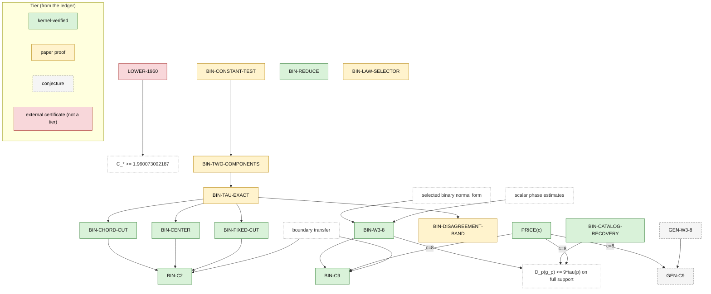

# Claim DAG and status ledger

This is the current status record. Each claim has its exact scope and evidence
below. [Lean contracts](lean-contracts.md) separate existing declarations from
future targets; [admissions](../verification/admissions.md) record the local
audits and their history.

## Status vocabulary

| Status | Meaning |
|---|---|
| `kernel-verified` | Lean compiled with no unfinished proof dependency, and its exact axiom set was audited. The repository in which this occurred is named. |
| `paper proof` | Complete rigorous prose derivation with no unresolved step; not formalized. |
| `conjecture` | Unresolved mathematical claim. |

External-source labels identify where and how evidence was checked. They are
qualifiers, not additional tiers. A composite proof inherits the weakest tier
of the inputs its own proof needs.

The dependency arrows below record where a claim's argument came from, which
is not always what its evidence rests on. A claim re-proved here by an
independent route inherits nothing from the paper argument it descends from.
`BIN-CHORD-CUT`, `BIN-CENTER` and `BIN-FIXED-CUT` are the case in point: each
descends from `BIN-TAU-EXACT`, whose general statement is a `paper proof`,
and each is `kernel-verified` here, because the Lean proofs need only the
stochastic optimum at a contact, which `tau_eq_contact` and
`tau_eq_at_topRoot` in
[Optimum](../StochasticToDeterministicLatents/Binary/FactorTwo/Optimum.lean)
supply and the audit pins.

## Dependencies

```text
selected binary normal form + scalar phase estimates --> BIN-W3-8
BIN-W3-8 + PRICE(8) + boundary transfer ----------------> BIN-C9
BIN-W3-8 + BIN-CATALOG-RECOVERY + PRICE(8) -------------> D_p(g_p) <= 9*tau(p) on full support

PRICE(8) + GEN-W3-8 ---------------------------> GEN-C9

LOWER-1960 ------------------------------------> C_* >= 1.960073002187

BIN-CONSTANT-TEST -----------------------------> BIN-TWO-COMPONENTS
BIN-TWO-COMPONENTS ----------------------------> BIN-TAU-EXACT
BIN-TAU-EXACT ---------------------------------> BIN-DISAGREEMENT-BAND
BIN-TAU-EXACT ---------------------------------> BIN-CHORD-CUT
BIN-TAU-EXACT ---------------------------------> BIN-CENTER
BIN-TAU-EXACT ---------------------------------> BIN-FIXED-CUT
BIN-CHORD-CUT + BIN-CENTER + BIN-FIXED-CUT + boundary transfer ---> BIN-C2
```

The binary stochastic-optimum rows supply the right-hand side of `BIN-C2`. The
three factor-two rows compare that value with $`T`$ along each contact chord,
and the boundary transfer, the same kernel-verified
`T_le_mul_tau_of_forall_fullSupport` that FactorNine uses, extends the bound to
laws with zero cells at constant two.

The same dependencies as a diagram, with the ledger tier as node colour;
regenerate it with `scripts/gen_diagrams.py` whenever the picture above or
the ledger table changes:



C9 bounds a selected chart code directly; its numerical upper bound does not
need the separate minimality theorem `BIN-REDUCE`, which therefore has no edge
above. Catalog recovery also bounds the mathematical law-only selector $`g_p`$
on full support (the third line; the endpoint is
`Binary.detScore_selector_le_nine_mul_tau_of_fullSupport`). `BIN-LAW-SELECTOR`
defines that selector and records the open executable contract; it is a
definition consumed by the third line, not a numerical claim.

`BIN-C2` is the binary constant two, `kernel-verified` here since 2026-09-08.
Its inputs are the three
factor-two rows, which compare the exact $`\tau(p)`$ of `BIN-TAU-EXACT` with
two deterministic scores on each contact chord, and the boundary transfer at
constant two. Nothing states that the constant is sharp.

`BIN-W3-8` requires full support. The generic theorem
`T_le_mul_tau_of_forall_fullSupport` transfers a supplied full-support bound on
$`T`$ to all laws. FactorNine supplies its binary premise at nine. The
[sparse proof](binary-factor-nine.md#6-sparse-and-degenerate-laws) gives no
corresponding selected-latent $`\mathrm{W3}`$ or named-selector
boundary guarantee.

## Ledger

Here $`C_*`$ is the infimum of constants $`C`$ for which
$`T(p) \le C\,\tau(p)`$ holds for every law on arbitrary finite alphabets.
Namespace prefixes in formal names below
are `StochasticToDeterministicLatents`.

| ID | Statement | Mathematical status | Evidence in this repository |
|---|---|---|---|
| `PRICE(c)` | If $`L`$ attains $`\tau(p)`$ and $`\mathrm{W3}(L) \le c\,\tau(p)`$, then $`T(p) \le (1+c)\,\tau(p)`$. | `kernel-verified` in this repository (2026-09-01), through the public declaration `StochasticToDeterministicLatents.T_le_one_add_mul_tau_of_w3`. | [Pricing](../StochasticToDeterministicLatents/Pricing.lean) supplies the fixed-code identity and conditional bound. The attaining latent and its $`\mathrm{W3}`$ bound are hypotheses; pricing alone supplies no numerical factor. |
| `BIN-REDUCE` | On the supplied positive transposed binary chart, every code in the canonical four-label code space `BinaryCode` is dominated in $`\mathrm{W3Cost}`$ by the constant or high-singleton code. | `kernel-verified` in this repository (2026-09-03), through the public declaration `StochasticToDeterministicLatents.Binary.TransposeChart.min_chartCodes_le_w3Cost`. The arbitrary-output-alphabet form, `kernel-verified` in the reviewed source workspace, remains qualified as such. | [Reduction](../StochasticToDeterministicLatents/Binary/Reduction.lean) audits all three cost-dominance endpoints. The public cost type uses `BinaryCode`; the arbitrary-output reward lemma is private, and no public theorem converts that broader statement to a cost bound. The supplied chart need not attain $`\tau`$. The infimum identity is not a separate declaration. |
| `BIN-W3-8` | Every full-support binary-observable law has some attained $`\tau`$-optimal latent $`L`$ with $`\mathrm{W3}(L) \le 8\,\tau(p)`$. | `kernel-verified` in this repository (2026-09-04), certificate-free, through `StochasticToDeterministicLatents.Binary.exists_optimalLatent_w3_le_eight_of_fullSupport`. | [FactorNine](../StochasticToDeterministicLatents/Binary/FactorNine.lean) selects an attained optimizer and a catalog code of cost at most $`8\,\tau(p)`$; `w3_le_w3Cost` gives the result. The selected-latent conclusion requires full support. |
| `BIN-C9` | For every binary $`2 \times 2`$ law, some deterministic code $`g`$ satisfies $`T(p) \le D_p(g) \le 9\,\tau(p)`$. | `kernel-verified` in this repository (2026-09-04), certificate-free, through `StochasticToDeterministicLatents.Binary.exists_code_detScore_le_nine_mul_tau` and `StochasticToDeterministicLatents.Binary.T_le_nine_mul_tau`. | [FactorNine](../StochasticToDeterministicLatents/Binary/FactorNine.lean) prices the full-support witness, uses [SparseLimit](../StochasticToDeterministicLatents/SparseLimit.lean), then finite deterministic attainment. Its named selector bound requires full support. The sparse conclusion contains neither a selected-latent $`\mathrm{W3}`$ estimate nor a bound for that selector. |
| `BIN-C2` | For every binary $`2 \times 2`$ law, $`T(p) \le 2\,\tau(p)`$; on full support the constant code or one of the four singleton codes has $`D_p(g) \le 2\,\tau(p)`$. | `kernel-verified` in this repository (2026-09-08), **both clauses**: the inequality through `StochasticToDeterministicLatents.Binary.T_le_two_mul_tau` ([Theorem 6.2](binary-factor-two.md#6-assembly)) and the full-support witness clause through `StochasticToDeterministicLatents.Binary.exists_witnessCode`. The witness clause is verified in the unlocated form stated above, an existential over the five codes; the page's [Theorem 6.1](binary-factor-two.md#6-assembly) says more, since the statement at the head of that page also *locates* the singleton at a lightest diagonal or off-diagonal cell according to the sign of the determinant, and no declaration here does that. | Proved from `BIN-CHORD-CUT`, `BIN-CENTER`, and `BIN-FIXED-CUT` on full support, then transferred to every law by the kernel-verified `T_le_mul_tau_of_forall_fullSupport` at constant two. **All three gates are now `kernel-verified` in this repository** (2026-09-08): `BIN-FIXED-CUT`, `BIN-CENTER` and, since the contact's mutual information was shown to be strictly positive, `BIN-CHORD-CUT`, as its own row records. `StochasticToDeterministicLatents.Binary.gates_of_chordDomain` completes a gate at every chord domain and `StochasticToDeterministicLatents.Binary.T_le_two_mul_tau` is the inequality of this row for every law. **The witness clause is now stated and proved** (2026-09-08), as `StochasticToDeterministicLatents.Binary.exists_witnessCode`: for every fully supported law one of the five codes named by `StochasticToDeterministicLatents.Binary.IsWitnessCode` has deterministic score at most twice the stochastic optimum. Two steps were added to reach it. `StochasticToDeterministicLatents.Binary.chordMargin_witness` keeps the two competitors the chord argument already exhibited instead of discarding them into the infimum, and `StochasticToDeterministicLatents.Binary.detScore_constantCode` computes the constant *code*'s score, where the bound already available was for the constant *latent*. The passage from the oriented region to an arbitrary law carries the code back along the table symmetries, through `StochasticToDeterministicLatents.Binary.of_oriented`; the five-code set is closed under that group, which is what makes four singletons sufficient. Nothing here shows fewer would not do. The five codes are named by the public definition `StochasticToDeterministicLatents.Binary.IsWitnessCode`, which is `Prop`-valued and therefore not itself proof evidence. The full-support hypothesis is the clause's own and is not removed, since the sparse-law transfer preserves the two optima but not a code. The identities and fixed logarithm comparisons of the page are replayed by `scripts/check_factor_two_identities.py`, which is not proof evidence. Sharpness of the constant is not claimed: no declaration exhibits a law and a code whose score equals $`2\,\tau(p)`$, and the library holds no binary lower bound above $`1`$. Two binary constants are now `kernel-verified` here, this one and the weaker `BIN-C9`. |
| `BIN-LAW-SELECTOR` | The determinant/mass/two-arm rule defines a law-only $`g_p`$; on count or rational input it is an exact finite procedure. | `paper proof` for the full mathematical rule. Selected exact count sublemmas were `kernel-verified` in the reviewed source workspace; the full contract was not. | [Selector](../StochasticToDeterministicLatents/Binary/Selector.lean) and [CountSelector](../StochasticToDeterministicLatents/Binary/CountSelector.lean) provide definitions and audited structural lemmas. No refinement connects the count or rational backend to the mathematical real selector. The latter has a verified C9 bound on full support; the full executable contract remains open. |
| `BIN-CATALOG-RECOVERY` | For a full-support law and a supplied contact or transpose-chart presentation of an optimal latent, the chart-selected constant or high-singleton code has an equal-$`\mathrm{W3Cost}`$ representative in the law-defined catalog, including the balanced tie. | `kernel-verified` in this repository (2026-09-03), through `StochasticToDeterministicLatents.Binary.exists_catalogCode_of_contactPresentation` and `StochasticToDeterministicLatents.Binary.exists_catalogCode_of_transposeChartPresentation`. | [CatalogRecovery](../StochasticToDeterministicLatents/Binary/CatalogRecovery.lean) proves the equal-cost recovery at a supplied presentation, including the balanced $`\mathrm{W3Cost}`$ tie; the tie is proved for $`\mathrm{W3Cost}`$, not for $`D_p`$. [NormalForm](../StochasticToDeterministicLatents/Binary/NormalForm.lean) supplies the presentation at the selected optimizer, and [FactorNine](../StochasticToDeterministicLatents/Binary/FactorNine.lean) composes them at factor eight; the law-quantified composition with a catalog code is private there, and only its $`\mathrm{W3}`$ weakening is public. The row-major representative need not be equivariant. No sparse-law statement about the selector is part of this row. |
| `BIN-CONSTANT-TEST` | For a binary law with nondegenerate marginals, $`\tau(p) = I_p(X;Y)`$ if and only if $`A \ge 0`$, $`E \ge 0`$, and $`V^3 \le AEM`$, with $`A, E, V, M`$ the explicit rational functions of the cells in the stochastic-optimum page; then $`T(p) = \tau(p) = I_p(X;Y)`$. | `paper proof` ([Theorem 4.1](binary-stochastic-optimum.md#4-the-rational-constant-optimality-test)). | Proved through the tangent test on the support face, a Gibbs variational identity, weighted Hoelder duality, and a quartic factorization. No Lean declaration states it; the identities are reproduced by `scripts/check_stochastic_optimum_identities.py`, which is not proof evidence. |
| `BIN-TWO-COMPONENTS` | Every $`\tau`$-optimal finite latent of a binary law, on any support, carries at most two distinct component laws on its positive-weight labels; merging equal components gives a two-label optimizer. | `paper proof` ([Theorem 5.1](binary-stochastic-optimum.md#5-at-most-two-component-laws)). | Proved by bounding the contact set of one supporting affine majorant of the concave envelope. The proposition `Binary.ContactClassification` in [TransposeNormalForm](../StochasticToDeterministicLatents/Binary/TransposeNormalForm.lean), proved by the kernel-verified `Binary.transposeNormalFormInputs_hold`, covers the full-support, selected-optimizer case in its own dual-kernel formulation; the two contact notions are not identified, so it is corroboration, not an input. |
| `BIN-TAU-EXACT` | For every binary law, $`\tau(p)`$ and the unique optimal component measure are explicit: product laws have $`\tau = T = I = 0`$; otherwise, after orienting $`ad - bc > 0`$, the cubic $`u^3 - (b+c)u^2 - bcu - bc(a+d)`$ with largest nonnegative root $`u_0`$ decides: constant optimality when $`\sqrt{ad} \le u_0`$, and otherwise the diagonal-swap pair with product $`u_0^2`$ and $`\tau(p) = \Psi(p) - \Phi(q^+)`$. | `paper proof` ([Theorems 6.6 and 6.7](binary-stochastic-optimum.md#6-the-cubic)). | Proved from `BIN-CONSTANT-TEST` and `BIN-TWO-COMPONENTS` through a factorization of the norm margin and the diagonal-swap tangent identity. The public `contact_root_identity` in [NormalForm](../StochasticToDeterministicLatents/Binary/NormalForm.lean) is this cubic in chart coordinates on the full-support two-contact chart, after the $`Y`$-label exchange that orients the chart's determinant; `StochasticToDeterministicLatents.Binary.tau_eq_at_topRoot` computes $`\tau`$ from a law that is fully supported and has nonnegative determinant, giving both branches of the dichotomy at the cubic's top root. No public declaration computes $`\tau`$ for an arbitrary law, and none states the uniqueness of the optimal component measure that this row also asserts, so the row keeps its tier. |
| `BIN-DISAGREEMENT-BAND` | If the disagreement mass $`p_{01} + p_{10}`$ of a binary law lies in $`[1\text{/}3, 2\text{/}3]`$, then $`\tau(p) = T(p) = I_p(X;Y)`$; no larger interval in that statistic alone suffices. | `paper proof` ([Corollary 7.1](binary-stochastic-optimum.md#7-consequences)). | A direct consequence of `BIN-TAU-EXACT`. No Lean declaration states it. |
| `BIN-CHORD-CUT` | On the contact chord of a nonconstant full-support binary law satisfying the page's (2.1) -- $`ad > bc`$ with $`a \ge d`$ and $`b \ge c > 0`$ -- the singleton margin is concave, the constant margin takes its minimum over every subinterval at an endpoint, and the constant margin at the upper contact is the positive mutual information $`I_{q^+}(X;Y)`$; hence a nonnegative constant margin at the chord center, or one chord point with both margins nonnegative together with a nonnegative singleton margin at the center, gives $`T(p) \le 2\,\tau(p)`$ for that law. Below the upper contact the two margins are $`2\,\tau - S_{11}`$ and $`2\,\tau - I`$ at the chord law. | `kernel-verified` in this repository (2026-09-08), through `StochasticToDeterministicLatents.Binary.singletonMargin_concaveOn`, `StochasticToDeterministicLatents.Binary.constantMargin_min_le`, `StochasticToDeterministicLatents.Binary.constantMargin_chordTop_pos`, and, for the implication from a gate to the bound at a supplied chord domain, `StochasticToDeterministicLatents.Binary.T_le_two_mul_tau_of_centerGate` and `StochasticToDeterministicLatents.Binary.T_le_two_mul_tau_of_cutGates` ([Theorem 2.5](binary-factor-two.md#2-the-contact-chord)). `StochasticToDeterministicLatents.Binary.T_le_two_tau_of_gates` is the same implication with the gate hypothesis quantified over every chord domain, which is the form `BIN-C2` consumes. | Proved from the chord formula of `BIN-TAU-EXACT` by two second-derivative computations. Its two shape facts are `kernel-verified` in this repository (2026-09-07) at a supplied chord domain, through `StochasticToDeterministicLatents.Binary.singletonMargin_concaveOn` and `StochasticToDeterministicLatents.Binary.constantMargin_min_le`, and so is each implication from a gate to the bound on the chord: `StochasticToDeterministicLatents.Binary.T_le_two_mul_tau_of_centerGate`, `StochasticToDeterministicLatents.Binary.T_le_two_mul_tau_of_cutGates`, and `StochasticToDeterministicLatents.Binary.T_le_two_tau_of_gates`, which quantifies over every chord domain. **A complete gate at every law is now proved**, by `StochasticToDeterministicLatents.Binary.gates_of_chordDomain`. `StochasticToDeterministicLatents.Binary.fixedCut_constantMargin_gt` and `StochasticToDeterministicLatents.Binary.fixedCut_singletonMargin_gt` supply two of the three hypotheses of `T_le_two_mul_tau_of_cutGates` below an eighth of off-diagonal mass, `StochasticToDeterministicLatents.Binary.fixedCut_mem_chord` places that cut inside the chord, and `StochasticToDeterministicLatents.Binary.center_singletonMargin_nonneg` supplies the third hypothesis; above an eighth, `StochasticToDeterministicLatents.Binary.center_constantMargin_pos` supplies the hypothesis of `StochasticToDeterministicLatents.Binary.T_le_two_mul_tau_of_centerGate`. `StochasticToDeterministicLatents.Binary.gates_of_chordDomain` performs the case split on the off-diagonal mass and puts those together. **The last conjunct is now proved as stated** (2026-09-08). The row says the constant margin at the contact is a *positive* mutual information; `StochasticToDeterministicLatents.Binary.constantMargin_chordTop` gives the identity with nonnegativity only, and `StochasticToDeterministicLatents.Binary.constantMargin_chordTop_pos` now gives the strict inequality. It rests on `StochasticToDeterministicLatents.Binary.psi_sub_phi_pos`, that a full-support binary law of nonvanishing determinant has positive mutual information, applied at the upper contact, whose determinant is `u ^ 2` less the off-diagonal product and so is positive by `StochasticToDeterministicLatents.Binary.offDiagonalProduct_lt_sq_topRoot`. This is an original argument for this tree rather than a transfer of adapted working material. **Every conjunct of the row as stated above is therefore verified here**, and the row is promoted. Two things the page says are not: the page's [Theorem 2.5](binary-factor-two.md#2-the-contact-chord) concludes $`T(p_{a'}) \le 2\,\tau(p_{a'})`$ for *every* $`a'`$ in the chord, where each declaration here concludes it for the law itself and no declaration bounds $`T`$ at another chord point; and the identification of the two margins with $`2\,\tau - S_{11}`$ and $`2\,\tau - I`$, by `StochasticToDeterministicLatents.Binary.singletonMargin_eq_two_mul_tau_sub` and `StochasticToDeterministicLatents.Binary.constantMargin_eq_two_mul_tau_sub`, is proved below the upper contact and not at it, where the separate identity `StochasticToDeterministicLatents.Binary.constantMargin_chordTop` serves instead. The same fact at the far end of a centre ray is still not proved, because nothing in this tree computes the determinant of the law at the critical radius; that endpoint is used only in its nonnegative form and nothing waits on it. |
| `BIN-CENTER` | At the center $`(m, b, c, m)`$ of the contact chord of a nonconstant full-support binary law satisfying the page's (2.1), with $`v = b + c`$: if $`v \le 1\text{/}8`$ the margin of the singleton code isolating the cell $`(1,1)`$ is at least $`4v\text{/}125`$ nats, and if $`v \ge 1\text{/}8`$ the constant code's margin is positive. | `kernel-verified` in this repository (2026-09-08), through `StochasticToDeterministicLatents.Binary.center_singletonMargin_ge` and `StochasticToDeterministicLatents.Binary.center_constantMargin_pos` ([Theorem 4.1](binary-factor-two.md#4-the-center)). | Proved by concavity of both margins along rays of fixed imbalance, from a curvature comparison of the contact potential with binary entropy, two estimates on the seam $`v = 1\text{/}8`$, and the tangent test of the stochastic-optimum page (Theorem 3.2, an input to `BIN-CONSTANT-TEST` and hence to `BIN-TAU-EXACT`) at one reference law. **Both parts are now stated and proved.** `StochasticToDeterministicLatents.Binary.center_singletonMargin_ge` is part (1) and `StochasticToDeterministicLatents.Binary.center_constantMargin_pos` is part (2), each on a supplied `ChordDomain`, with `StochasticToDeterministicLatents.Binary.center_singletonMargin_nonneg` and `StochasticToDeterministicLatents.Binary.center_constantMargin_ge` the weakened and quantitative forms beside them. The margins are in bits and the row's $`4v\text{/}125`$ is in nats, the factor of `Real.log 2` in the theorem's denominator being that conversion. **The route differs from the page's on part (2)**: the page argues that a concave function positive at both ends of the ray is positive throughout, which needs the value at the far end to be positive; this tree corrects the margin by an affine function of the mass and needs that value only to be nonnegative, taking the strictness instead from the bound's numerator. So the page's positivity at the far end is still not proved here and is not needed. The page's closed forms [(4.2)](binary-factor-two.md#4-the-center) for the two margins at the centre are `kernel-verified` here (2026-09-07) on a supplied `ChordDomain`: `StochasticToDeterministicLatents.Binary.log_two_mul_constantMargin_center` is the first line as the page states it, and `StochasticToDeterministicLatents.Binary.log_two_mul_singletonMargin_center` is the second with its two $`\gamma`$ terms written out in the marginal entropy and the binary entropy of $`v`$, an equivalence no public declaration states. Both are identities in the coordinates $`(v, z)`$ and bound neither margin. The contact potential of [Lemma 3.1](binary-factor-two.md#3-the-contact-potential) is `kernel-verified` here as well (2026-09-07): `StochasticToDeterministicLatents.Binary.tangentCert_contact_values` gives the four coefficients that lemma's proof computes, in bits where the page writes them in nats, with `certDiagonal` the lemma's $`K`$ and `certOffDiagonal` its $`b^3\text/P_b^2`$, and `StochasticToDeterministicLatents.Binary.log_two_mul_phi_contact` is (3.1) read through $`k = -\Phi(q^+)`$. Neither $`K`$ nor $`P_b`$ is defined in a numbered display. The equality of the two diagonal coefficients is proved here from a polynomial identity in the cells, not through [Lemma 6.4](binary-stochastic-optimum.md#6-the-cubic) as on the page; the conclusion is the same. Section 4's reference-plane step -- that because the two diagonal coefficients agree, a contact plane's value at a law depends only on the diagonal and off-diagonal sums, so bounding $`\Phi`$ at one reference law bounds it at the centre -- is `kernel-verified` here (2026-09-07) as `StochasticToDeterministicLatents.Binary.phi_contact_le_chordMidpoint_pairing`, for the plane at the contact of any law satisfying `ChordDomain` rather than the page's single $`q_{\mathrm{r}}`$. The reference law is that contact, not the chord domain: $`q_{\mathrm{r}}`$ has $`\sqrt{ad} = u_0`$ and so fails `Nonconstant`, which no chord domain does. That step is unnumbered prose on the page, beside (4.20). The page reaches $`\Phi \le \ell_{q_{\mathrm{r}}}`$ through Theorem 3.2 of the stochastic-optimum page at a constant-optimal law; the Lean reaches it through `positivityGate_contactAt`, `normBound_of_positivityGate`, and `majorizes_tangentCert_of_normBound`, the chain `tau_eq_contact` already uses. That declaration supplies no number. The page's reference law itself is `kernel-verified` here (2026-09-07): `StochasticToDeterministicLatents.Binary.chordDomain_referencePlane` and `StochasticToDeterministicLatents.Binary.tangentCert_referencePlane` give four explicit rational laws and their planes, and the first plane's contact is the page's $`q_{\mathrm{r}} = (112, 8, 8, 7)\text{/}135`$ exactly, with the page's $`K = 375\text{/}343`$ and $`P_b^2\text{/}b^3 = 375\text{/}8`$. The other three planes have no counterpart on the page, which uses one reference law; they belong to the Lean route's covering of the imbalance and are not evidence for any page display. Still no bound: the planes are supplied and nothing yet evaluates one. The Lean reaches the constant seam by a route of its own, and the next step of that route is `kernel-verified` here (2026-09-07) as `StochasticToDeterministicLatents.Binary.centerPlaneBound_concaveOn`: the constant margin's scalar, at a plane's pairing with a seam law of off-diagonal mass $`1\text{/}8`$ and split $`(1 \pm z)\text{/}16`$, is concave in the imbalance $`z`$ on $`[0, 1]`$, so a range of $`z`$ reduces to its endpoints. The second derivative does not mention the plane, so one proof serves all four. **This is evidence for no display on the page.** The page's Proposition 4.5 proves the constant seam differently, with no reference plane: it separates the two off-diagonal cells' entropy, bounds the remainder's derivative in $`w = bc`$, and evaluates a closed form at $`b = 1\text{/}8`$, $`c = 0`$. Section 4's own concavity, [Lemma 4.3](binary-factor-two.md#4-the-center), is **radial** -- in $`v`$ along the ray, propagating positivity outward from the seam -- not a reduction of a $`z`$-range to endpoints. Which plane covers which range, and the bound itself, are still not stated. The arithmetic those endpoint comparisons rest on is `kernel-verified` here (2026-09-07): `StochasticToDeterministicLatents.Binary.log_seventeen_bounds` and its seven companions enclose $`\mathrm{log}`$ at 17, 19, 23, 47, 173, 179, 313 and 3581, which together with the five of [LogValues](../StochasticToDeterministicLatents/Binary/FactorTwo/LogValues.lean) and Mathlib's $`\mathrm{log}\,2`$ span every ratio the centre compares. These are facts about real numbers and mention no law. The comparisons themselves are `kernel-verified` here (2026-09-07): `StochasticToDeterministicLatents.Binary.centerPlaneBound_endpoints_one` and its three companions show each plane's bound exceeds $`1\text{/}100`$ at both ends of one of the four intervals $`[0, 1\text{/}3]`$, $`[1\text{/}3, 2\text{/}3]`$, $`[2\text{/}3, 19\text{/}20]`$ and $`[19\text{/}20, 1]`$, which cover $`[0, 1]`$; all fourteen primes are used and no other occurs. **This too is evidence for no display on the page**, which reaches the constant seam by Proposition 4.5 without a reference plane, and which uses one reference law where these are four. Two steps of the Lean's own route remained: carrying a plane's bound to the constant margin, and assigning a plane to a range of the imbalance. The **seam itself** -- the boundary case $`v = 1\text{/}8`$ of this row's second arm -- is now `kernel-verified` here (2026-09-07): `StochasticToDeterministicLatents.Binary.seam_constantMargin_center_gt` puts the constant margin at the centre of the contact chord above $`1\text{/}100`$ nats, for any chord domain whose off-diagonal mass is exactly $`1\text{/}8`$. It supplies both missing steps named above: the plane's constant dominates $`\log 2 \cdot \Phi`$ at the contact, through `phi_contact_le_chordMidpoint_pairing` and `tangentCert_referencePlane`, and one of the four planes covers every imbalance. This is the first bound on a margin in the reference-plane route. It is the page's **Proposition 4.5**, which concludes $`M_0(m) > 1\text{/}200`$ in nats under the same hypotheses, with **twice that constant** and by a different route: the page separates the two off-diagonal cells' entropy and bounds the remainder's derivative in $`bc`$, using no reference plane at all. The identification of the centre's constant margin, in nats, with the page's $`M_0(m)`$ is `log_two_mul_constantMargin_center`, recorded above. *At that point the row was not yet verified*: its second arm claimed a positive constant margin for every $`v \ge 1\text{/}8`$ and only $`v = 1\text{/}8`$ was proved, its first arm was untouched, and (4.20) held only in part. Both arms were completed afterwards, as the opening of this cell records. Its inequality $`\Phi(q^+) \le \ell_{q_{\mathrm{r}}}(q^+)`$ is now proved inside `CenterSeam`, as a private step, for any chord domain rather than the page's balanced law and against all four planes, the first of which is the page's own; its closed form over 2, 3, 5 and 7 is stated nowhere, and no public declaration states either. The page's **contact chart** and its [Lemma 3.3](binary-factor-two.md#3-the-contact-potential) are `kernel-verified` here (2026-09-07), which opens this row's other arm. `StochasticToDeterministicLatents.Binary.ChartDomain` is that lemma's parameter set, carried in the symmetric functions $`r = x + y`$ and $`\omega = xy`$ of the two off-diagonal cells rescaled by the cubic's root, together with $`4\omega \le r^2`$, which the page's parametrization by $`x`$ and $`y`$ themselves makes automatic. `StochasticToDeterministicLatents.Binary.chart_identities` is display (3.4): its first entry is the definition of the chart's root here, its second is that definition up to associating a product, and its remaining three are proved. `StochasticToDeterministicLatents.Binary.chartRoot_cubic` is the identity $`\mathrm{cubic}(u) = u^2 (u n - \omega)`$ that stands behind both halves of that lemma's proof, stated in the direction the chart makes available: the page derives $`u_0 n = \omega`$ from the cubic, while here $`u n = \omega`$ holds by definition and the cubic's vanishing is what follows. That is the page's converse paragraph, not its forward one. And `StochasticToDeterministicLatents.Binary.chartDiscriminant_eq` identifies the chart's curvature input with $`v^2 - 4w`$, the squared difference of the two off-diagonal cells. That is the discriminant of the quadratic whose roots are those cells, not of the contact cubic. `StochasticToDeterministicLatents.Binary.chart_pos` collects the positivity the chart's consumers need. **None of this is evidence about any law.** Nothing in that module identifies the chart's scalars with the cells of a chord domain -- that identification is the forward direction of Lemma 3.3's correspondence, and it is stated in `CenterLaws` below, not there -- and no declaration in it mentions a law. The chart's **radial derivatives** are `kernel-verified` here in closed form (2026-09-07), which is the arithmetic behind [Lemma 3.4](binary-factor-two.md#3-the-contact-potential): `StochasticToDeterministicLatents.Binary.chartRootDeriv_eq`, `StochasticToDeterministicLatents.Binary.chartCubicDeriv_eq`, `StochasticToDeterministicLatents.Binary.chartDeterminant_eq` and `StochasticToDeterministicLatents.Binary.chartCommonDeriv_eq` give the root's radial derivative, the cubic's derivative at the root, the quantity $`u^2 - w`$ and the cell-independent part of the contact masses' derivatives, each as an explicit ratio of polynomials in $`r`$ and $`\omega`$. `StochasticToDeterministicLatents.Binary.chartLogKDeriv_eq` is the right side of display **(3.7)**. The page's reading of that display is now verified in part, below. `StochasticToDeterministicLatents.Binary.chartFactors_pos` is the page's own list of positive factors, and every denominator here is one of them. The chart's **second-order expressions** are `kernel-verified` here (2026-09-07), which carries this row's other arm as far as algebra can take it. `StochasticToDeterministicLatents.Binary.chartContactSecondOrder` is the right side of the page's display **(3.9)**, and `StochasticToDeterministicLatents.Binary.chartContactSecondOrder_eq_logKDeriv` proves it equal to the radial derivative of $`\log K`$ recorded above: that is the page's own step from (3.9) to (3.7), which the page takes by cancelling a factor $`v + s`$ against one and which is taken here by carrying both sides to the same closed form. `StochasticToDeterministicLatents.Binary.chartContactSecondOrder_lt` is display **(3.8)**, the strict comparison with the ratio of off-diagonal to diagonal mass, and its proof exhibits the difference as the explicit positive quantity the page names. `StochasticToDeterministicLatents.Binary.chartConstantSecondOrder_neg` and `StochasticToDeterministicLatents.Binary.chartSingletonSecondOrder_neg` put the page's two expressions of display **(4.3)** below zero on the chart domain. *At that point nothing stated that those expressions are the two margins' second radial derivatives* -- the analytic half of [Lemma 4.3](binary-factor-two.md#4-the-center) -- since no declaration in those modules differentiates anything and none of them mentions a law. Both second radial derivatives are now `kernel-verified` here, as `StochasticToDeterministicLatents.Binary.hasDerivAt_rayConstantSlope` and `StochasticToDeterministicLatents.Binary.hasDerivAt_raySingletonSlope`. The concavity itself is still not stated as a declaration, and is not used: the promoted route reaches both arms without it. The curvature facts of the Lean's own chord route are proved and remain separate declarations in the chord's coordinates rather than along a ray: `StochasticToDeterministicLatents.Binary.singletonMargin_concaveOn` puts the isolating code's margin concave along the chord, and `StochasticToDeterministicLatents.Binary.constantMargin_min_le` denies the constant margin an interior minimum there. The chart's **ray of fixed imbalance** is `kernel-verified` here (2026-09-07), and it is the first declaration of this apparatus to mention a law. `StochasticToDeterministicLatents.Binary.rayLaw` is the page's centre law $`p^\circ = (m, b, c, m)`$ of [section 4](binary-factor-two.md#4-the-center), with $`m = (1 - v)\text/2`$, carried along the ray [(3.6)](binary-factor-two.md#3-the-contact-potential), which fixes the two off-diagonal cells at $`b = v(1+z)\text/2`$ and $`c = v(1-z)\text/2`$; that display states the two off-diagonal cells only, and the equal diagonal halves are section 4's. It is built on the public `tableOfEntries` rather than on a constructor of its own, and it is **reparametrised**: the page runs along the ray in the off-diagonal mass $`v`$, and this family runs in the chart's radius $`r`$, with $`v`$ recovered as `StochasticToDeterministicLatents.Binary.rayMass`. `StochasticToDeterministicLatents.Binary.rayLaw_isPMF` proves every law on the closed ray is a probability law, with full support at positive radius. `StochasticToDeterministicLatents.Binary.criticalRadius_spec` puts the critical radius in $`(0, 1)`$ and its mass in $`[1\text/4, 1\text/3)`$, with the chart's interior condition vanishing there; that mass is the page's $`v_c(z)`$ of display [(4.1)](binary-factor-two.md#4-the-center) and those are that display's bounds, though the equivalence (4.1) states, with nonconstancy of the centre law, is not stated here; `StochasticToDeterministicLatents.Binary.radius_lt_criticalRadius_iff` is the test for a radius lying below it; and `StochasticToDeterministicLatents.Binary.ray_boundary_values` gives the mass and root at it. **This says which laws the chart describes and nothing more:** along the ray the chart's parameters are the radius $`r`$ and the product $`\kappa(z)\,r^2`$ with $`\kappa(z) = (1 - z^2)\text/4`$, and no declaration in the module bounds a margin or differentiates anything. At the time that module was admitted, that a ray law's parameters satisfy `ChartDomain` was not stated, so no chart result yet applied to a law. **That is now stated**, in the module described next, and the qualification is withdrawn. The chart and the laws it describes are joined here, and this is `kernel-verified` (2026-09-07). `StochasticToDeterministicLatents.Binary.chartDomain_of_chordDomain` is the forward direction of the correspondence in [Lemma 3.3](binary-factor-two.md#3-the-contact-potential): a chord domain's two off-diagonal cells, rescaled by its top root, are positive and ordered, they satisfy `ChartDomain`, and that root is the chart's root. `StochasticToDeterministicLatents.Binary.chart_certValues` is display **(3.5)**, stated through the public `certDiagonal` and `certOffDiagonal` rather than through the page's contact masses $`P_b`$ and $`P_c`$, which are the same content one algebraic step away: the page's $`K`$ is the first, and $`b^3\text/P_b^2`$ the second. `StochasticToDeterministicLatents.Binary.log_two_mul_phi_contact_chart` evaluates $`\log 2 \cdot \Phi`$ at a chord domain's contact as minus the new definition `StochasticToDeterministicLatents.Binary.chartHeight` at those coordinates; the minus is the page's $`k = -\Phi(q^+)`$ and both sides are in nats. Running the other way, `StochasticToDeterministicLatents.Binary.chartDomain_ray` puts the ray's parameters in the chart domain for every radius strictly between zero and the critical one, and `StochasticToDeterministicLatents.Binary.chordDomain_rayLaw` makes the law at such a radius a chord domain with the ray's root. `StochasticToDeterministicLatents.Binary.rayLaw_chartCoordinates` identifies that law's own chart coordinates with the radius and the ray's product, and `StochasticToDeterministicLatents.Binary.rayRoot_eq_chartRoot` gives the chart's root at the ray's cell coordinates as the ray's root; without those two the chart's results would be about a different pair of parameters from the ones the ray is indexed by. **Together these are the first declarations in this tree under which a chart result applies to a law.** The converse direction of that correspondence -- that every point of the chart domain comes from a chord domain -- is stated only along the ray, by `StochasticToDeterministicLatents.Binary.chordDomain_rayLaw`, and not for a general chart point. Derivatives in the chart are then supplied, and this is `kernel-verified` (2026-09-07). Move along a path in the chart, that is, let the two rescaled cells be differentiable functions of a real parameter with positive values below the boundary. `StochasticToDeterministicLatents.Binary.hasDerivAt_chartRoot` gives the chart root's derivative along that path, with the quotient rule's value; `StochasticToDeterministicLatents.Binary.hasDerivAt_log_certDiagonal` gives the derivative of the diagonal certificate value's logarithm; and `StochasticToDeterministicLatents.Binary.hasDerivAt_chartHeight` gives the height's, which is the page's display **(3.3)** of [section 3](binary-factor-two.md#3-the-contact-potential) contracted against the path's velocity in the contact's two off-diagonal cells: the coefficient of the first cell is $`\log K + \log L_b`$ and the coefficient of the second is $`\log K + \log L_c`$, where $`L_c`$ is the same off-diagonal certificate value with the two cells exchanged, that value not being symmetric in them. The page states (3.3) inside a lemma that also asserts smoothness in those cells by the implicit function theorem; **neither that smoothness nor differentiability in the cells themselves is stated here**, since the chart's inverse is not shown to be differentiable. The chart apparatus reaches the two margins here, and this is `kernel-verified` (2026-09-07). `StochasticToDeterministicLatents.Binary.chordDomain_rayCoordinates` reads any chord law in the ray's coordinates: its imbalance $`(b - c)\text/v`$ lies in $`[0, 1)`$, its radius $`v\text/u`$ lies strictly between zero and the critical radius, and at that pair the ray's root, off-diagonal mass and law are the chord law's own root, its own off-diagonal mass, and the chord law recentred at its midpoint. The two new definitions `StochasticToDeterministicLatents.Binary.rayConstantScalar` and `StochasticToDeterministicLatents.Binary.raySingletonScalar` write the centre scalars of `StochasticToDeterministicLatents.Binary.centerConstantScalar` and `StochasticToDeterministicLatents.Binary.centerSingletonScalar` as functions of the imbalance and the radius alone, with no law in them, and `StochasticToDeterministicLatents.Binary.rayConstantScalar_eq` and `StochasticToDeterministicLatents.Binary.raySingletonScalar_eq` say that read at a chord law's own coordinates they are that law's two margins at the chord's midpoint. **This is the first place where the chart apparatus reaches a margin.** It is an identity, not a bound: no declaration here bounds either margin, and none differentiates anything. The **seam** of this row -- the locus of off-diagonal mass exactly $`v = 1\text/8`$ -- is `kernel-verified` in the chart's radius here (2026-09-07), which opens the isolating code's route to it. `StochasticToDeterministicLatents.Binary.chordDomain_seamCoordinates` reads a chord law of that mass in the radius $`r = v\text/u`$: the radius lies in $`(1\text/2, 1)`$, the new definition `StochasticToDeterministicLatents.Binary.seamProduct` at that radius is the law's own off-diagonal product over the square of its root, `StochasticToDeterministicLatents.Binary.seamImbalanceSq` there is the square of the law's own imbalance, and `StochasticToDeterministicLatents.Binary.seamSingletonScalar`, a function of the radius alone with no law in it, is the law's isolating-code margin at the chord's midpoint in nats. The lower end $`r > 1\text/2`$ is the page's assertion, in the prose opening its seam paragraph, that the top root lies below $`1\text/4`$; the proof evaluates the cubic at $`1\text/4`$ as display [(4.4)](binary-factor-two.md#4-the-center) does, but establishes only positivity and states neither that display's closed form nor its constant $`7\text/2048`$. Running the other way, `StochasticToDeterministicLatents.Binary.rayValues_of_seamRadius` takes a radius in that interval at which the squared imbalance is nonnegative -- not every radius there is, which is what the balanced-radius theorem below turns on -- and puts its chart parameters in the chart domain, with the root $`1\text/(8 r)`$, the mass $`1\text/8`$ and the law there, which is the new `StochasticToDeterministicLatents.Binary.seamLaw` at the imbalance. **The seam is reparametrised**: the page runs it in $`\delta = b - c`$ on $`[0, 1\text/8)`$ and this route runs it in the radius, the same change recorded above for the ray. One consequence is `StochasticToDeterministicLatents.Binary.exists_balanced_seamRadius`, which finds a radius in $`(1\text/2, 2\text/3)`$ carrying a balanced seam law; **that is evidence for no display on the page**, where the balanced law is simply $`\delta = 0`$ and needs no existence proof. Still no bound: nothing in that module bounds either margin, and nothing in it differentiates anything. The signs that route turns on are `kernel-verified` here as well (2026-09-07). `StochasticToDeterministicLatents.Binary.seamCells_pos` puts the seam's two rescaled cells positive, strictly ordered and below one, with both of the denominators the seam's logarithms carry positive, at any radius in $`(1\text/2, 1)`$ whose squared imbalance is strictly positive; `StochasticToDeterministicLatents.Binary.seam_log_identity` collapses the combination of logarithms the seam's derivative produces into one logarithm of a ratio, an identity in two positive reals that mentions no law; and `StochasticToDeterministicLatents.Binary.seam_logRatio_pos` puts that ratio above one, by factoring the difference of the two weighted cells through a quartic in their sum and product and making that quartic a ratio of polynomials with positive coefficients under the substitution $`t = (2r - 1)\text/(1 - r)`$. **This too is evidence for no display on the page**, whose Proposition 4.6 bounds the isolating code's seam derivative in $`\delta = b - c`$ through an integral remainder inequality and never forms this ratio. It is a sign, not a bound: no declaration in that module bounds either margin, and none of them differentiates anything. **The isolating code's margin along the seam is now differentiated**, and this is `kernel-verified` (2026-09-07). `StochasticToDeterministicLatents.Binary.hasDerivAt_seamImbalanceSq` gives the squared imbalance's derivative in the radius, the new definition `StochasticToDeterministicLatents.Binary.seamImbalanceSqDeriv`, at every radius strictly between $`1\text/2`$ and $`1`$; and `StochasticToDeterministicLatents.Binary.seamImbalanceSq_strictMonoOn` puts the squared imbalance strictly increasing there. `StochasticToDeterministicLatents.Binary.hasDerivAt_seamSingletonScalar` is the margin's derivative at a radius of that interval **where the squared imbalance is strictly positive**, which excludes the balanced radius, the square root in the denominator below being zero there: the squared imbalance's derivative over $`32\,z`$ times the logarithm of the previous paragraph. The closed form of the height at the seam's two cells that both rest on, `StochasticToDeterministicLatents.Binary.seamHeight_eq`, is public and holds at the balanced radius too, where the derivative does not. Since that logarithm is positive and so is the imbalance's derivative, the margin increases with the radius; that module states neither the increase nor any bound, and `StochasticToDeterministicLatents.Binary.seamSingletonScalar_monotoneOn`, in `StochasticToDeterministicLatents.Binary.FactorTwo.CenterSeamMargin`, states the increase. The route is again not the page's, which differentiates in $`\delta = b - c`$ by its display (4.7); the two derivatives are of the same function in different parameters and no declaration relates them. **The seam is closed**, and this is `kernel-verified` (2026-09-07). `StochasticToDeterministicLatents.Binary.seam_singletonMargin_gt` puts the isolating code's margin at the chord's midpoint above $`1 / (250 \ln 2)`$ bits for every chord domain whose off-diagonal mass is $`1\text/8`$, and `StochasticToDeterministicLatents.Binary.seamSingletonScalar_monotoneOn` states that the margin is monotone in the radius from a balanced radius upward. The bound is the constant of the page's display (4.17), which over the prime basis is the page's own $`(204 \ln 2 - 50 \ln 3 - 96 \ln 5 + 35 \ln 7) / 16`$. **Only the bound half of Proposition 4.6 is claimed.** The proposition also asserts a quadratic growth in the imbalance; no declaration states that, and monotonicity in the radius is a different statement, not a weakening of it. The value at the balanced radius and the continuity that reaches it are private to the module. **The ray's coordinates are differentiated**, and this is `kernel-verified` (2026-09-07). Along a ray of fixed imbalance, `StochasticToDeterministicLatents.Binary.hasDerivAt_rayRoot` and `StochasticToDeterministicLatents.Binary.hasDerivAt_rayMass` give the derivatives of the chart's root and of the off-diagonal mass in the radius, the second through the new definition `StochasticToDeterministicLatents.Binary.rayMassDeriv`, and `StochasticToDeterministicLatents.Binary.rayMass_strictMonoOn` puts the mass strictly increasing from the centre to the critical radius, so a law is located on its ray by its off-diagonal mass alone. These are rational identities: no margin, no logarithm and no law occurs in any of them, and **nothing here bears on the curvature comparison the row's paper proof runs on**. **The two margins are now differentiated along the ray, twice**, and this is `kernel-verified` (2026-09-07). The page differentiates along the ray in the off-diagonal mass, writing $`\mathcal{D} = v\,\partial_v`$ at [(3.6)](binary-factor-two.md#3-the-contact-potential); this route differentiates in the radius, so each value below carries the factor `StochasticToDeterministicLatents.Binary.rayMassDeriv`, which is the mass's derivative in the radius and which the previous module puts above zero strictly inside the ray. Dividing it out is the change of variable. Every slope and scalar named below is in nats, as are the contact height and the two centre scalars they differentiate. `StochasticToDeterministicLatents.Binary.hasDerivAt_rayHeight` differentiates the contact height, exhibiting the new definition `StochasticToDeterministicLatents.Binary.rayHeightSlope` as the height's derivative in the mass; `StochasticToDeterministicLatents.Binary.hasDerivAt_rayConstantScalar` and `StochasticToDeterministicLatents.Binary.hasDerivAt_raySingletonScalar` do the same for the two ray margins recorded above, exhibiting the new definitions `StochasticToDeterministicLatents.Binary.rayConstantSlope` and `StochasticToDeterministicLatents.Binary.raySingletonSlope`; and `StochasticToDeterministicLatents.Binary.hasDerivAt_rayHeightSlope`, `StochasticToDeterministicLatents.Binary.hasDerivAt_rayConstantSlope` and `StochasticToDeterministicLatents.Binary.hasDerivAt_raySingletonSlope` differentiate those three slopes again, with values the chart's second-order expressions over the mass squared. Read through the change of variable these last three are display **(3.7)** for the height and the two **equalities** of display **(4.3)** for the margins, which is the analytic half of [Lemma 4.3](binary-factor-two.md#4-the-center) and the step every module of this apparatus had deferred. `StochasticToDeterministicLatents.Binary.chartDomain_ray` is the hypothesis every one of them runs on: at a radius strictly below the critical one, that radius and the squared-imbalance product lie in the chart's domain. `StochasticToDeterministicLatents.Binary.chartRootDeriv_mul_rayMassDeriv` completes the account of the chart's radial expressions: `StochasticToDeterministicLatents.Binary.chartRootDeriv` times the mass's derivative is the mass times the root's derivative, so that expression is the root's derivative in the mass times the mass, which is the page's $`\mathcal{D}u`$. **The inequalities of (4.3) are nowhere composed with *these* change-of-variable equalities.** They are used elsewhere, in the ray's two slope-antitonicity proofs; what no declaration does is carry them over to the mass. `StochasticToDeterministicLatents.Binary.chartConstantSecondOrder_neg` and `StochasticToDeterministicLatents.Binary.chartSingletonSecondOrder_neg` were admitted earlier and put both expressions below zero; no declaration puts the two halves together, and the composition is not immediate, since these derivatives are in the radius and the page's concavity is in the mass. No bound on either margin is claimed here, and the second arm of this row is untouched. **The ray reaches its two ends**, and this is `kernel-verified` here (2026-09-07). Every derivative of this apparatus is taken strictly inside the ray, where the chart's interior condition holds, though the mass's strict monotonicity and the chart normalizer's positivity already hold on the closed interval; what the endpoint comparisons still need is the contact height and the two margins at the ends themselves. `StochasticToDeterministicLatents.Binary.rayNorm_pos` puts the chart's normalizer positive on the closed interval from the centre to the critical radius, and `StochasticToDeterministicLatents.Binary.rayNorm_factors_pos`, its factored form, was made public in the same commit for it; the public `StochasticToDeterministicLatents.Binary.chartFactors_pos` cannot serve, since its chart-domain hypothesis fails at the centre. `StochasticToDeterministicLatents.Binary.rayHeight_eq` writes the contact height along the ray in the ray's own coordinates, with the root and the off-diagonal mass as the only nonpolynomial pieces. `StochasticToDeterministicLatents.Binary.continuousOn_rayMass`, `StochasticToDeterministicLatents.Binary.continuousOn_rayConstantScalar` and `StochasticToDeterministicLatents.Binary.continuousOn_raySingletonScalar` then put the off-diagonal mass and both margins continuous on that closed interval, the two margins in nats. `StochasticToDeterministicLatents.Binary.raySingletonScalar_zero` gives the isolating code's margin at the centre of the chart, and it is zero. **That value is the `0 log 0 = 0` convention and not a limit**: at radius zero the mass and the root both vanish, so every entropy term that carries either of them takes the convention's own value, and the terms that remain cancel because their coefficients sum to zero. Read together, that value and the continuity beside it are part (1) of the page's [Lemma 4.4](binary-factor-two.md#4-the-center) -- but **in the radius, and as a pair, not as a limit**: the page states a limit as the off-diagonal mass tends to zero, and no declaration in this tree states any limit. Of that lemma's part (2), only the continuity is here. Of that lemma's part (2), the identification is now proved and is described below; nothing in this module bounds a margin or differentiates anything. **The ray's law at its far end**, and this is `kernel-verified` here (2026-09-08). At the critical radius the diagonal product is exactly the square of the ray's root, so the geometric mean of the diagonal is that root. No chord domain holds there at any top root: such a domain requires its own root strictly below that mean and so strictly below the ray's root, and then requires the cubic to be strictly positive above its own root, while the cubic vanishes at the ray's root and the results that take one, including `StochasticToDeterministicLatents.Binary.rayConstantScalar_eq`, do not apply. The route that would have supplied one is closed for the matching reason: it asks for the chart's interior condition, which degenerates to an equality at that radius. `StochasticToDeterministicLatents.Binary.rayLaw_coalesces` is the page's statement that the contact radius vanishes there and the upper contact is the law itself. `StochasticToDeterministicLatents.Binary.rayConstantScalar_boundary_eq` is then the identification in part (2) of the page's [Lemma 4.4](binary-factor-two.md#4-the-center): the constant code's margin at the critical radius is `Real.log 2` times the law's mutual information, written `Psi - Phi` as elsewhere in this tree. **The margin is in nats and the mutual information in bits, and the factor of `Real.log 2` is the conversion**; both units stand in the one statement, which is why that factor is written out. `StochasticToDeterministicLatents.Binary.rayConstantScalar_boundary_nonneg` says that margin is nonnegative. **The page claims it is positive, and gives a reason -- the law there is not a product law.** Amended 2026-09-08: the general strict inequality is now `kernel-verified` here as `StochasticToDeterministicLatents.Binary.psi_sub_phi_pos`, but **nothing in this tree states that the law at the critical radius has a nonvanishing determinant**, so that hypothesis is unavailable and the endpoint below keeps its nonnegative form. The endpoint comparison consumes only the nonnegativity, so the chain does not wait on the strict inequality. The endpoint principle the centre's remaining comparisons will run on is `kernel-verified` here (2026-09-07). `StochasticToDeterministicLatents.Binary.min_endpoints_le_of_antitoneSlope_affine` says that a function continuous on a closed interval, whose derivative there is a positive weight times an antitone factor, takes no interior value below both of its endpoint values, and that this survives subtracting an affine function of a second function whose derivative is that same weight; `StochasticToDeterministicLatents.Binary.antitoneOn_Ioo_of_hasDerivAt_nonpos` is the wrapper that supplies the antitone factor from a nonpositive derivative. **These are facts about arbitrary real functions**: no law, no code, no chart, no margin and no logarithm occurs in either statement. `StochasticToDeterministicLatents.Binary.min_endpoints_le_of_antitoneSlope_affine` was applied by no declaration when it was admitted; both centre bounds apply it now, as the centre paragraph below records; `StochasticToDeterministicLatents.Binary.antitoneOn_Ioo_of_hasDerivAt_nonpos` is applied on the ray, as described next. They are the form step (2) of the page's proof of [Theorem 4.1](binary-factor-two.md#4-the-center) takes -- that a concave function on a closed interval with positive values at both ends is positive throughout -- and **evidence for no display**. **The seam on a ray, and the two slopes' order there**, and this is `kernel-verified` here (2026-09-08). `StochasticToDeterministicLatents.Binary.exists_raySeamRadius` puts a radius strictly inside every ray at off-diagonal mass exactly $`1\text{/}8`$: the mass is $`0`$ at the centre, at least $`1\text{/}4`$ at the critical radius, and continuous between them, so the intermediate value theorem applies. This is the page's remark in [section 4](binary-factor-two.md#4-the-center) that $`1\text{/}8 < 1\text{/}4 \le v_c(z)`$ puts the seam inside every ray. `StochasticToDeterministicLatents.Binary.rayConstantSlope_antitoneOn` and `StochasticToDeterministicLatents.Binary.raySingletonSlope_antitoneOn` put the two margin slopes antitone on the open ray, from `StochasticToDeterministicLatents.Binary.hasDerivAt_rayConstantSlope` and `StochasticToDeterministicLatents.Binary.hasDerivAt_raySingletonSlope` together with `StochasticToDeterministicLatents.Binary.chartConstantSecondOrder_neg` and `StochasticToDeterministicLatents.Binary.chartSingletonSecondOrder_neg`. **These are stated in the radius, not in the off-diagonal mass**: the page's [Lemma 4.3](binary-factor-two.md#4-the-center) is concavity in the mass, the mass is strictly increasing in the radius, and that change of variable is carried out by no declaration in this tree. `StochasticToDeterministicLatents.Binary.rayConstantScalar_gt_of_seam` and `StochasticToDeterministicLatents.Binary.raySeam_margins_gt` read the two seam bounds at the ray's own law, through `StochasticToDeterministicLatents.Binary.chordDomain_rayLaw` and the coordinate identities `StochasticToDeterministicLatents.Binary.rayConstantScalar_eq` and `StochasticToDeterministicLatents.Binary.raySingletonScalar_eq`: at a radius of mass $`1\text{/}8`$ the constant code's margin exceeds $`1\text{/}100`$ and the isolating code's exceeds $`1\text{/}250`$, both in nats. These are [Propositions 4.5 and 4.6](binary-factor-two.md#4-the-center) read on a ray, and they add no mathematics to the bounds themselves. **No endpoint comparison is made in that module**: nothing in it says a margin is positive anywhere but at a seam radius. **The centre theorem itself**, and this is `kernel-verified` here (2026-09-08). `StochasticToDeterministicLatents.Binary.center_singletonMargin_ge` and `StochasticToDeterministicLatents.Binary.center_constantMargin_pos` are the two parts of the row's statement, and `StochasticToDeterministicLatents.Binary.center_singletonMargin_nonneg` and `StochasticToDeterministicLatents.Binary.center_constantMargin_ge` are the weakened and quantitative forms beside them. Each takes a chord domain and compares the margin at the midpoint of its chord: the isolating code's is at least $`4v\text{/}125`$ nats when $`v \le 1\text{/}8`$, and the constant code's is strictly positive when $`v \ge 1\text{/}8`$. The argument is `StochasticToDeterministicLatents.Binary.min_endpoints_le_of_antitoneSlope_affine`, applied on the ray between the seam and one end, with the affine correction chosen so that both endpoint values are ones already proved. At that point promoting this row promoted nothing else, `BIN-C2` still waiting on `BIN-CHORD-CUT`, `BIN-FIXED-CUT` and the boundary transfer; all three have since been supplied, and `BIN-C2` is `kernel-verified`. Of the chart apparatus, what is still not stated: of the three arbitrary-path derivatives, only the height's is specialised to the ray by a public declaration, which is `StochasticToDeterministicLatents.Binary.hasDerivAt_rayHeight` above; `StochasticToDeterministicLatents.Binary.hasDerivAt_log_certDiagonal` is specialised to the ray only inside the proofs of the module that differentiates the margins along it, never as a public statement; and `StochasticToDeterministicLatents.Binary.hasDerivAt_chartRoot` is not specialised at all, the ray's root derivative being proved directly as `StochasticToDeterministicLatents.Binary.hasDerivAt_rayRoot` in the previous module, so no declaration relates the two. `StochasticToDeterministicLatents.Binary.chartCommonDeriv` is still not shown to be a derivative of anything, and `StochasticToDeterministicLatents.Binary.chartLogKDeriv` is reached only through its equality with `StochasticToDeterministicLatents.Binary.chartContactSecondOrder`, never as the derivative of the diagonal certificate value's logarithm that its name claims; and the radial concavity of [Lemma 4.3](binary-factor-two.md#4-the-center) is still not stated as a declaration. |
| `BIN-FIXED-CUT` | For $`v \le 1\text{/}8`$ the smaller contact mass satisfies $`D < v\text{/}2`$, and at the chord point whose smaller diagonal cell is $`3D`$ the constant margin exceeds $`3D\text{/}208`$ nats and the singleton margin exceeds $`D\text{/}100`$ nats. | `kernel-verified` in this repository (2026-09-07), through `StochasticToDeterministicLatents.Binary.contactMass_lt_half_disagreement`, `StochasticToDeterministicLatents.Binary.fixedCut_constantMargin_gt`, and `StochasticToDeterministicLatents.Binary.fixedCut_singletonMargin_gt`. | The page's [Lemma 5.1 and Theorems 5.2 and 5.3](binary-factor-two.md#5-the-fixed-cut) are the same three statements, and each margin reduces there to a one-variable inequality and a fixed rational-logarithm comparison. The three declarations carry a supplied `ChordDomain`, and the two margin bounds are stated multiplied through by $`\log 2`$ so that no public statement divides by it. `ChordDomain` is the page's (2.1) together with `u` a top root and `p` nonconstant, which are the standing hypotheses of sections 2 to 5; the page's $`0 < v`$ follows from full support, so the Lean hypothesis is the page's $`v \le 1\text{/}8`$ alone. [Strip](../StochasticToDeterministicLatents/Binary/FactorTwo/Strip.lean) names the chord point, as `fixedCut`, and places it strictly inside the chord, where `StochasticToDeterministicLatents.Binary.constantMargin_eq_two_mul_tau_sub` and `StochasticToDeterministicLatents.Binary.singletonMargin_eq_two_mul_tau_sub` identify the two margins with $`2\,\tau - I`$ and $`2\,\tau - S_{11}`$ at that point, so the bounds are about the quantities this row names. The scalar inequalities under the two margin bounds are `StochasticToDeterministicLatents.Binary.constantRatioTerm_gt` and `StochasticToDeterministicLatents.Binary.singletonTerms_gt`, and the logarithm comparisons under those are the five enclosures of [LogValues](../StochasticToDeterministicLatents/Binary/FactorTwo/LogValues.lean). `StochasticToDeterministicLatents.Binary.chordPotential_remainder` and `StochasticToDeterministicLatents.Binary.constantRatioTerm_affine` are the identities the constant arm assembles; the singleton arm adds four estimates of its own, none of them public. The row's promotion rests on the three declarations named above and on nothing outside this repository. |
| `GEN-W3-8` | Every arbitrary finite law admits a selected attained optimizer with $`\mathrm{W3}(L) \le 8\,\tau(p)`$. | `conjecture`. | No proof. See the [general construction problem](blueprint.md#6-the-open-arbitrary-alphabet-factor-nine-route). |
| `GEN-C9` | For arbitrary finite alphabets, $`T(p) \le 9\,\tau(p)`$. | `conjecture`; `PRICE(8)` would prove it from `GEN-W3-8`, whose premise remains open. | No proof. The generic sparse transfer still requires a full-support numerical bound for these alphabets. |
| `LOWER-1960` | There exists a law on $`\mathrm{Fin} 12 \times \mathrm{Fin} 12`$ with $`T(p)\text{/}\tau(p) \ge 1.960073002187`$; hence the best universal finite-alphabet constant $`C_*`$ is at least $`1.960073002187`$. | External compiler-backed Lean certificate using `native_decide`; not `kernel-verified` under this repository's terminology. Its `T` and `tau` are the definitions of upstream pull request #2 at commit `34e3f898`, retained verbatim in that repository, not the revision pinned here. | The external [StochToDet1960.exists_lower_bound_1960073002187](https://github.com/satchlj/stoch-to-det-lower/blob/main/StochToDet1960/Proof.lean) supplies the witness. Its compiler-backed verification is not reproduced here. |

## Formal scope

All locally verified rows above are supported by root-imported declarations
in [Verify.lean](../Verify.lean). Each headline has discovered axiom set
`[propext, Classical.choice, Quot.sound]`. The
[admission record](../verification/admissions.md) includes the complete module
coverage and the two smaller axiom sets among supporting theorems.

The canonical code alphabet represents partitions of the observation space. The
library has no public theorem converting an arbitrary-output code into
`BinaryCode` with preserved cost. Likewise, the full-support recovery theorem
uses balanced equality of $`\mathrm{W3Cost}`$; no public declaration states a
balanced $`D_p`$ identity or the cell-relabeling invariance of `detScore` and
$`T`$. Agreement with the reviewed selector construction is recorded as a
source comparison, not a theorem relating this library to unpublished names.

The [selector refinement contracts](lean-contracts.md#bin-law-selector)
specify the missing count/rational normalization, support, score-key, and
agreement results. Total executable definitions and catalog membership alone
do not discharge that contract.

## Publication rule

Promote a row only when its exact public declaration passes the complete
[local verification procedure](../verification/README.md) and is named here.
A result checked only in another workspace retains that qualifier and its
actual verification mechanism.
