# Lean declaration contracts

The [Verso dependency blueprint](https://AlexisOlson.github.io/stochastic-to-deterministic-latents/)
is deployed from `main`. Its graph links the existing
public declarations and checks their generated status against the claim
ledger; the [nested package](../blueprint/README.md) documents local builds.

This document distinguishes the public Lean API from signatures that remain
targets. Each code block is labelled at its point of use. Existing theorem
signatures omit their proof bodies; they are written in the
`StochasticToDeterministicLatents` namespace and are not standalone programs.
The [current module map](#current-modules-and-admission) links the implemented
layers. The [claim ledger](claims.md) records their mathematical scopes and
evidence tiers.

The contracts use the existing public types:

- `Latent p`, `Latent.score`, and `tau p`;
- `Code α β`, `detScore p g`, and `T p`;
- `w3Cost L g` and `w3 L`; and
- `Binary.RealTable`, `Binary.BinaryCode`, `Binary.catalog`, and
  `Binary.selector`.

Every numerical endpoint quantified directly over a law `p` includes
`IsPMF p`. Structural selector declarations are total on arbitrary real
tables. Conditional pricing takes `L : Latent p`, and chart reduction takes a
chart whose latent supplies its law. Numerical bounds select one attained
optimizer. They do not quantify over every optimizer.

## Pricing and selector interfaces

### `PRICE(c)`

**Existing and audited.** Defined in
[`Pricing.lean`](../StochasticToDeterministicLatents/Pricing.lean):

```lean
theorem T_le_one_add_mul_tau_of_w3
    {p : α × β → ℝ}
    (L : Latent p)
    (hL_optimal : L.score = tau p)
    (c : ℝ)
    (hw3 : w3 L ≤ c * tau p) :
    T p ≤ (1 + c) * tau p
```

The section context supplies `{α β : Type*} [Fintype α] [Fintype β]`
and `[DecidableEq α] [DecidableEq β]`.

The root imports this module, and `Verify.lean` audits the endpoint.

### `BIN-LAW-SELECTOR`

**Existing definitions and audited theorems.** Defined in
[`Binary/Selector.lean`](../StochasticToDeterministicLatents/Binary/Selector.lean):

```lean
noncomputable def Binary.catalog (p : Binary.RealTable) :
    List Binary.BinaryCode

noncomputable def Binary.selector (p : Binary.RealTable) :
    Binary.BinaryCode

theorem Binary.selector_mem_catalog (p : Binary.RealTable) :
    Binary.selector p ∈ Binary.catalog p

theorem Binary.detScore_selector_le_of_mem
    (p : Binary.RealTable) (g : Binary.BinaryCode)
    (hg : g ∈ Binary.catalog p) :
    detScore p (Binary.selector p) ≤ detScore p g
```

**Unimplemented targets.** The backends in
[`Binary/CountSelector.lean`](../StochasticToDeterministicLatents/Binary/CountSelector.lean)
do not yet have these refinement theorems:

```lean
theorem Binary.CountTable.selector_eq_realSelector
    (q : Binary.CountTable) (htotal : 0 < q.total) :
    q.selector = Binary.selector q.realTable

theorem Binary.RationalTable.selector_eq_realSelector
    (q : Binary.RationalTable) :
    q.selector = Binary.selector q.realTable
```

The refinement endpoints use literal code equality because both sides share
the support canonicalization and tie rules. A membership theorem alone does
not establish executable refinement.

## Binary reduction

`Binary.TransposeChart` contains positive component masses $`a,b,c,d`$, their
normalization, the order $`c \le b`$, and a prior `0 < pi ≤ 1/2`. Its public
projections include `law` and `latent`. In the oriented chart,
`cell10` is the high-likelihood-ratio singleton.

### `BIN-REDUCE`

**Existing and audited.** Defined in
[`Binary/Reduction.lean`](../StochasticToDeterministicLatents/Binary/Reduction.lean):

```lean
theorem Binary.TransposeChart.min_chartCodes_le_w3Cost
    (D : Binary.TransposeChart) (g : Binary.BinaryCode) :
    min
        (w3Cost D.latent Binary.constantCode)
        (w3Cost D.latent (Binary.singletonCode Binary.cell10))
      ≤ w3Cost D.latent g
```

`BinaryCode` is the canonical four-label code space. It is taken to represent
every partition of the four observation cells, including partitions originally
written with a larger finite output alphabet. This is a modelling convention
fixing what `Code α β` is taken to represent, not a theorem: no
declaration in this library maps a code into a larger finite alphabet onto a
`BinaryCode`, and `w3Cost` is not defined on any other label type. The
`BIN-REDUCE` endpoint above is therefore kernel-verified over `BinaryCode`
only.

## Binary numerical endpoints

### `BIN-W3-8`

**Existing and audited.** Defined in
[`Binary/FactorNine.lean`](../StochasticToDeterministicLatents/Binary/FactorNine.lean):

```lean
theorem Binary.exists_optimalLatent_w3_le_eight_of_fullSupport
    (p : Binary.RealTable) (hp : IsPMF p) (hpos : ∀ z, 0 < p z) :
    ∃ L : Latent p,
      L.score = tau p ∧
      w3 L ≤ 8 * tau p
```

The delivered endpoint requires full support. The sparse transfer operates
only on `T`.

### `BIN-C9`

**Existing and audited.** Defined in
[`Binary/FactorNine.lean`](../StochasticToDeterministicLatents/Binary/FactorNine.lean):

```lean
theorem Binary.exists_code_detScore_le_nine_mul_tau
    (p : Binary.RealTable) (hp : IsPMF p) :
    ∃ g : Binary.BinaryCode,
      T p ≤ detScore p g ∧
      detScore p g ≤ 9 * tau p
```

**Existing and audited.** The same
[`FactorNine` module](../StochasticToDeterministicLatents/Binary/FactorNine.lean)
proves both endpoints:

```lean
theorem Binary.T_le_nine_mul_tau (p : Binary.RealTable) (hp : IsPMF p) :
    T p ≤ 9 * tau p

theorem Binary.detScore_selector_le_nine_mul_tau_of_fullSupport
    (p : Binary.RealTable) (hp : IsPMF p) (hpos : ∀ z, 0 < p z) :
    detScore p (Binary.selector p) ≤ 9 * tau p
```

The `T` and existential-code endpoints cover every binary law. The named
selector guarantee requires full support. The count and rational refinement
endpoints above remain open, so this guarantee is for the mathematical
real-valued selector.

## Catalog recovery

The full-support proof must keep the selected optimizer and the recovered
catalog code in one existential statement. Two unrelated existence theorems
would not show that the same optimizer satisfies both properties. A theorem
about every optimal latent would be stronger than the mathematical result.

### `BIN-CATALOG-RECOVERY`

**Existing and audited.** Defined in
[`Binary/CatalogRecovery.lean`](../StochasticToDeterministicLatents/Binary/CatalogRecovery.lean):

```lean
theorem Binary.exists_catalogCode_of_contactPresentation
    {p : Binary.RealTable} (hp : IsPMF p) (hpos : ∀ z, 0 < p z)
    (D : SeedSetup p) (K : Clustering D)
    (M : Binary.ContactPresentation p)
    (P : Binary.QuotientPresentation hpos D K M) :
    ∃ g ∈ Binary.catalog p,
      w3 K.quotientSeedSetup.L = w3 M.chart.toTransposeChart.latent ∧
      w3Cost K.quotientSeedSetup.L g =
        w3Cost K.quotientSeedSetup.L
          (Binary.transportCode M.relabel.equiv.symm
            (Binary.phaseSelector M.chart.toTransposeChart)) ∧
      w3Cost K.quotientSeedSetup.L g =
        w3Cost M.chart.toTransposeChart.latent
          (Binary.phaseSelector M.chart.toTransposeChart)
```

A companion theorem, `Binary.exists_catalogCode_of_transposeChartPresentation`,
states the same recovery from a supplied transpose chart. Both are at a
supplied presentation and carry no numerical constant.
[`Binary.NormalForm`](../StochasticToDeterministicLatents/Binary/NormalForm.lean)
constructs such a presentation at the selected optimizer on the two-class
branch, and `Binary.FactorNine` composes the two with the chart cost bound.
That law-quantified composition, with the catalog code kept, is the public
proposition `Binary.SmallCatalogFactorEightWitness`; its inhabitant is private
to `FactorNine`, and the public headline
`Binary.exists_optimalLatent_w3_le_eight_of_fullSupport` is its weakening
through `w3_le_w3Cost`. A public theorem restating the private witness would
be a "make public" task, not a proof task, and no row asks for it.

## Binary stochastic optimum

The four rows `BIN-CONSTANT-TEST`, `BIN-TWO-COMPONENTS`, `BIN-TAU-EXACT`,
and `BIN-DISAGREEMENT-BAND` are `paper proof` in the
[binary stochastic optimum](binary-stochastic-optimum.md) page. No public
declaration states any of them.

**Existing declarations the proofs rest on.** `latent_score_eq` (the score
decomposition), `exists_optimalLatent` (attainment), `tau_le_score`, and
`Latent.ofFunction_score_eq_detScore`, all in
[`Bridge.lean`](../StochasticToDeterministicLatents/Bridge.lean) and
[`Latent.lean`](../StochasticToDeterministicLatents/Latent.lean). The
binary marginals `Binary.rowMarginal` and `Binary.columnMarginal` are defined
in [`Binary/TransposeNormalForm.lean`](../StochasticToDeterministicLatents/Binary/TransposeNormalForm.lean).

**Unimplemented targets.** The quantities $`A, E, V, M`$ and the cubic are new
definitions; the signatures below name them without fixing their placement.

```lean
noncomputable def Binary.normA (p : Binary.RealTable) : ℝ
noncomputable def Binary.normE (p : Binary.RealTable) : ℝ
noncomputable def Binary.normV (p : Binary.RealTable) : ℝ
noncomputable def Binary.normM (p : Binary.RealTable) : ℝ

theorem Binary.tau_eq_mutualInfo_iff_constantTest
    (p : Binary.RealTable) (hp : IsPMF p)
    (hrow : ∀ i, 0 < Binary.rowMarginal p i)
    (hcol : ∀ j, 0 < Binary.columnMarginal p j) :
    tau p = mutualInfo Prod.fst Prod.snd p ↔
      0 ≤ Binary.normA p ∧ 0 ≤ Binary.normE p ∧
        Binary.normV p ^ 3 ≤ Binary.normA p * Binary.normE p * Binary.normM p

theorem Binary.optimalLatent_two_components
    {p : Binary.RealTable} (hp : IsPMF p) (L : Latent p)
    (hL : L.score = tau p) :
    ∃ q₁ q₂ : Binary.RealTable,
      ∀ v, L.prior v ≠ 0 → L.comp v = q₁ ∨ L.comp v = q₂

theorem Binary.tau_eq_of_constantBranch
    (p : Binary.RealTable) (hp : IsPMF p)
    (hdet : 0 < p (0, 0) * p (1, 1) - p (0, 1) * p (1, 0))
    (hle : Real.sqrt (p (0, 0) * p (1, 1)) ≤ Binary.cubicRoot p) :
    tau p = mutualInfo Prod.fst Prod.snd p

theorem Binary.tau_eq_of_mixedBranch
    (p : Binary.RealTable) (hp : IsPMF p)
    (hdet : 0 < p (0, 0) * p (1, 1) - p (0, 1) * p (1, 0))
    (hlt : Binary.cubicRoot p < Real.sqrt (p (0, 0) * p (1, 1))) :
    tau p = Psi p - Phi (Binary.swapContact p)

theorem Binary.tau_eq_mutualInfo_of_disagreementBand
    (p : Binary.RealTable) (hp : IsPMF p)
    (h1 : 1 / 3 ≤ p (0, 1) + p (1, 0)) (h2 : p (0, 1) + p (1, 0) ≤ 2 / 3) :
    tau p = mutualInfo Prod.fst Prod.snd p
```

`Binary.swapContact p` denotes the component $`q^+`$ of the page; its
definition requires `Binary.cubicRoot`, which is the largest nonnegative root
of $`u^3 - (b+c)u^2 - bcu - bc(a+d)`$.

**`Binary.tau_eq_of_mixedBranch` is proved on full support**, and is listed
above only for its unrestricted shape.
`StochasticToDeterministicLatents.Binary.tau_eq_at_topRoot` is
`kernel-verified` and audited, and its first disjunct is that statement. Both
identifications are definitional: the hypothesis
`Binary.cubicRoot p < Real.sqrt (p (0, 0) * p (1, 1))` is
`Binary.Nonconstant p (Binary.cubicRoot p)`, since `Binary.diagonalProduct` is
`entryA * entryD` by `rfl`; and `Binary.swapContact p` is
`Binary.contactAt p (Binary.cubicRoot p)`, which is how `swapContact` is
defined.
What is open is the statement without `FullSupport`, which needs the page's
support-face argument; no result in this repository consumes it, because laws
with a zero cell reach the factor-two bound through
`T_le_mul_tau_of_forall_fullSupport` instead. A definition of the
root by `Classical.choose` from an existence lemma is acceptable; the theorems
do not require it to be computable.

**The two definitions are supplied.** `Binary.cubicRoot` and
`Binary.swapContact` are defined in
[`Binary/FactorTwo/Defs.lean`](../StochasticToDeterministicLatents/Binary/FactorTwo/Defs.lean)
over that same cubic, the root by choice as permitted and determined by
`isTopRoot_unique`, and `swapContact p = contactAt p (cubicRoot p)`. The two
branch theorems above remain unimplemented as stated.
[`Binary/FactorTwo/Optimum.lean`](../StochasticToDeterministicLatents/Binary/FactorTwo/Optimum.lean)
proves `tau_eq_at_topRoot`, which splits on the same test — the branch
condition `Binary.Nonconstant p u` is $`u < \sqrt{ad}`$ — and weakens
$`0 < \det`$ to $`0 \le \det`$, but it assumes `FullSupport p` and its constant
branch concludes $`\tau(p) = \Psi(p) - \Phi(p)`$ rather than naming the mutual
information. Closing the gap to the signatures above needs the sparse case and
that identification.

**A formalization route.** The two-contact chart of
[`Binary/NormalForm.lean`](../StochasticToDeterministicLatents/Binary/NormalForm.lean)
already carries the cubic. Its `contact_root_identity`,

```math
(1 + x^2 + x^4)\,A_0\,D_0 = x^4\,(x^2 - A_0 - D_0),
```

is, after the $`Y`$-label exchange that orients the chart's determinant positive,
the statement $`f_p(u_0) = 0`$ with $`u_0 = x^2 \text{/} Q`$ and
$`Q = 1 + x^4 + A_0 + D_0`$: substituting the exchanged chart law into the
cubic and clearing $`Q^3`$ gives
$`x^4\,(x^2 - A_0 - D_0) - (1 + x^2 + x^4)\,A_0\,D_0`$, the identity with its
two sides subtracted. This is an identity check, not a theorem of the library.
It suggests proving `Binary.tau_eq_of_mixedBranch` on full support by
identifying the selected optimizer's chart with the diagonal-swap pair, and
proving the constant branch through the rational test. The sparse cases need
the support-face argument of the page, which the library's full-support seed
setup does not supply.

## Binary factor two

All four rows of this section -- `BIN-C2`, `BIN-CHORD-CUT`, `BIN-CENTER` and
`BIN-FIXED-CUT` -- are now `kernel-verified` here, and the
[binary factor two](binary-factor-two.md) page is their prose derivation. The
supplied declarations are named in the module map at the end of this page and
listed against the target signatures below; where a supplied shape differs from
the target, the difference is recorded. Several parts of the page are not supplied. The *location* of the singleton
witness, which the page reads off the sign of the determinant, is stated by no
declaration here. Neither is the page's concavity in the mass, nor its strict
positivity at the far end of a centre ray, where only nonnegativity is proved
and only nonnegativity is needed, nor the chord-wide form of its Theorem 2.5,
nor the quadratic-growth half of its Proposition 4.6. The claim ledger records
each of these against the row it belongs to.

**Prerequisite targets.** `Binary.cubicRoot` and `Binary.swapContact` are
defined, and `Binary.tau_eq_at_topRoot` supplies the right-hand side on full
support -- which is `Binary.tau_eq_of_mixedBranch` itself on that hypothesis,
as recorded above. Only the sparse statement is open, and this section does not
need it: the bound reaches laws with a zero cell through
`T_le_mul_tau_of_forall_fullSupport`.

**Existing declarations the proof rests on.** `T_le_detScore`
and `exists_optimalCode` in
[`Deterministic.lean`](../StochasticToDeterministicLatents/Deterministic.lean)
bound and attain $`T`$; `Binary.constantCode` and `Binary.singletonCode` in
[`Binary/Table.lean`](../StochasticToDeterministicLatents/Binary/Table.lean)
name the two kinds of witness; the cell symmetries of
[`Binary/Symmetry.lean`](../StochasticToDeterministicLatents/Binary/Symmetry.lean)
transport codes and their scores; and `T_le_mul_tau_of_forall_fullSupport` in
[`SparseLimit.lean`](../StochasticToDeterministicLatents/SparseLimit.lean)
extends a full-support bound to every law.

**Target signatures.** Every target below is now supplied, in the shapes
recorded after the block. The margins below are the entropy expressions of
the page, in bits, so every quantitative bound of the page is divided by
$`\ln 2`$; only positivity is consumed downstream. `Binary.chordLaw p a`
denotes the chord law $`(a, b, c, s - a)`$, `Binary.contactMass p` the smaller
diagonal cell of `Binary.swapContact p`, `Binary.constantMargin p a` the value
$`2\,\tau - I`$ and `Binary.singletonMargin p a` the value $`2\,\tau - S_{11}`$
at `Binary.chordLaw p a`; the hypotheses `Binary.Oriented p` collect
`IsPMF p`, full support, $`ad - bc > 0`$, $`a \ge d`$, $`b \ge c`$, and
$`\sqrt{ad} > u_0`$. The signatures name these without fixing their placement.

```lean
theorem Binary.T_le_two_mul_tau (p : Binary.RealTable) (hp : IsPMF p) :
    T p ≤ 2 * tau p

theorem Binary.exists_witness_detScore_le_two_mul_tau
    (p : Binary.RealTable) (hp : IsPMF p) (hpos : ∀ z, 0 < p z) :
    ∃ g : BinaryCode, (g = Binary.constantCode ∨ ∃ z, g = Binary.singletonCode z) ∧
      detScore p g ≤ 2 * tau p

theorem Binary.singletonMargin_concaveOn (p : Binary.RealTable) (hp : Binary.Oriented p) :
    ConcaveOn ℝ (Set.Icc ((p (0, 0) + p (1, 1)) / 2) (Binary.swapContact p (0, 0)))
      (Binary.singletonMargin p)

theorem Binary.constantMargin_ge_min_endpoints
    (p : Binary.RealTable) (hp : Binary.Oriented p) {x y z : ℝ}
    (hx : (p (0, 0) + p (1, 1)) / 2 ≤ x) (hxy : x ≤ y) (hyz : y ≤ z)
    (hz : z ≤ Binary.swapContact p (0, 0)) :
    min (Binary.constantMargin p x) (Binary.constantMargin p z) ≤ Binary.constantMargin p y

theorem Binary.constantMargin_contactEnd_pos
    (p : Binary.RealTable) (hp : Binary.Oriented p) :
    0 < Binary.constantMargin p (Binary.swapContact p (0, 0))

theorem Binary.T_le_two_mul_tau_of_centerGate
    (p : Binary.RealTable) (hp : Binary.Oriented p)
    (h0 : 0 ≤ Binary.constantMargin p ((p (0, 0) + p (1, 1)) / 2)) :
    T p ≤ 2 * tau p

theorem Binary.T_le_two_mul_tau_of_cutGates
    (p : Binary.RealTable) (hp : Binary.Oriented p) {t : ℝ}
    (ht : (p (0, 0) + p (1, 1)) / 2 ≤ t ∧ t ≤ Binary.swapContact p (0, 0))
    (h0 : 0 ≤ Binary.singletonMargin p ((p (0, 0) + p (1, 1)) / 2))
    (h1 : 0 ≤ Binary.singletonMargin p t) (h2 : 0 ≤ Binary.constantMargin p t) :
    T p ≤ 2 * tau p

theorem Binary.centerSingletonMargin_ge
    (p : Binary.RealTable) (hp : Binary.Oriented p)
    (hv : p (0, 1) + p (1, 0) ≤ 1 / 8) :
    4 * (p (0, 1) + p (1, 0)) / (125 * Real.log 2) ≤
      Binary.singletonMargin p ((p (0, 0) + p (1, 1)) / 2)

theorem Binary.centerConstantMargin_pos
    (p : Binary.RealTable) (hp : Binary.Oriented p)
    (hv : 1 / 8 ≤ p (0, 1) + p (1, 0)) :
    0 < Binary.constantMargin p ((p (0, 0) + p (1, 1)) / 2)

theorem Binary.contactMass_lt_half_disagreement
    (p : Binary.RealTable) (hp : Binary.Oriented p)
    (hv : p (0, 1) + p (1, 0) ≤ 1 / 8) :
    Binary.contactMass p < (p (0, 1) + p (1, 0)) / 2

theorem Binary.fixedCut_constantMargin_gt
    (p : Binary.RealTable) (hp : Binary.Oriented p)
    (hv : p (0, 1) + p (1, 0) ≤ 1 / 8) :
    3 * Binary.contactMass p / (208 * Real.log 2) <
      Binary.constantMargin p (p (0, 0) + p (1, 1) - 3 * Binary.contactMass p)

theorem Binary.fixedCut_singletonMargin_gt
    (p : Binary.RealTable) (hp : Binary.Oriented p)
    (hv : p (0, 1) + p (1, 0) ≤ 1 / 8) :
    Binary.contactMass p / (100 * Real.log 2) <
      Binary.singletonMargin p (p (0, 0) + p (1, 1) - 3 * Binary.contactMass p)
```

The page also uses the closed form of the contact potential $`-\Phi(q^+)`$
and its gradient (Lemmas 3.1 and 3.2), which a formalization would state about
`Binary.swapContact p`; they are consequences of the tangent identity behind
`Binary.tau_eq_of_mixedBranch` and need no separate row.

**What the chord modules supply.** The chord law and the two margins are
defined in
[`Binary/FactorTwo/`](../StochasticToDeterministicLatents/Binary/FactorTwo/),
with one difference of shape: they take the top root as an explicit argument,
`Binary.chordAt p t`, `Binary.constantMargin p u t` and
`Binary.singletonMargin p u t`, rather than reading it from
`Binary.swapContact p`. The hypothesis bundle is `Binary.ChordDomain p u`,
which is `Binary.Oriented p` at $`u_0 = u`$ together with
`Binary.IsTopRoot p u`. The shape difference costs nothing:
`Binary.constantMargin_eq_two_mul_tau_sub` and
`Binary.singletonMargin_eq_two_mul_tau_sub` identify the two margins with
$`2\,\tau - I`$ and $`2\,\tau - S_{11}`$ at every chord point below the upper
contact, taken there against that point's own $`\tau`$.

On that bundle, `Binary.singletonMargin_concaveOn` and
`Binary.constantMargin_min_le` are the concavity and no-interior-minimum
signatures above, and `Binary.T_le_two_mul_tau_of_centerGate` and
`Binary.T_le_two_mul_tau_of_cutGates` are the two conditional bounds, each
carrying `Binary.ChordDomain p u` where the signature above carries
`Binary.Oriented p`. A third gate, which has no signature above, takes the
isolating margin nonnegative at both ends of the segment.

`Binary.T_le_two_tau_of_gates` is the conditional form of
`Binary.T_le_two_mul_tau` itself. It proves $`T(p) \le 2\,\tau(p)`$ for every
probability law from a hypothesis that supplies one of the three gates at every
chord domain, which is more than the two conditional bounds assume at $`p`$
alone: the orientation carries an arbitrary law to an oriented one, and the
gate is needed there.

Two differences of name and shape. `Binary.constantMargin_chordTop` gives the
contact end nonnegative; the strict form `Binary.constantMargin_contactEnd_pos`
is supplied as `Binary.constantMargin_chordTop_pos`, which rests on
`Binary.psi_sub_phi_pos`, that a full-support binary law of nonvanishing
determinant has positive mutual information. And
`Binary.exists_witness_detScore_le_two_mul_tau` is supplied as
`Binary.exists_witnessCode`, with the anonymous disjunction of the target
replaced by the public `Prop`-valued definition `Binary.IsWitnessCode` and the
pointwise positivity by `FullSupport`; the conclusion is the same, and neither
form locates the singleton.

Of the five quantitative rows, all five are supplied, each with
`Binary.ChordDomain p u` in place of `Binary.Oriented p` and with
`Binary.chordBottom p u` for `Binary.contactMass p`. The contact-mass bound is
`Binary.contactMass_lt_half_disagreement`; the same module defines
`Binary.fixedCut p u` as the diagonal mass less three times that cell, and
places it strictly inside the segment. The two fixed-cut estimates are
`Binary.fixedCut_constantMargin_gt` and `Binary.fixedCut_singletonMargin_gt`
at that point, with one further difference of shape: each is stated multiplied
through by `Real.log 2`, as `3 * Binary.chordBottom p u / 208 < Real.log 2 *
...`, rather than dividing by it, so that no public statement carries
`Real.log 2` in a denominator.

`Binary.centerSingletonMargin_ge` and `Binary.centerConstantMargin_pos` are
supplied as `Binary.center_singletonMargin_ge` and
`Binary.center_constantMargin_pos`. They are the rest of the hypothesis of
`Binary.T_le_two_tau_of_gates` -- the first supplies the isolating margin at
the chord center below an eighth, which the cut branch needs alongside the two
estimates above, and the second the constant gate above an eighth. With them,
`Binary.gates_of_chordDomain` closes one of the three gates at every chord
domain and `Binary.T_le_two_mul_tau` is the row's inequality for every law.

## Arbitrary finite alphabets

These declarations remain conjectural.

### `GEN-W3-8`

**Conjectural target.** No public declaration proves this estimate.

```lean
theorem exists_optimalLatent_w3_le_eight
    {α β : Type*}
    [Fintype α] [Fintype β]
    [DecidableEq α] [DecidableEq β]
    (p : α × β → ℝ) (hp : IsPMF p) :
    ∃ L : Latent p,
      L.score = tau p ∧
      w3 L ≤ 8 * tau p
```

### `GEN-C9`

**Conjectural target.** No public declaration proves this arbitrary-alphabet
bound.

```lean
theorem T_le_nine_mul_tau
    {α β : Type*}
    [Fintype α] [Fintype β]
    [DecidableEq α] [DecidableEq β]
    (p : α × β → ℝ) (hp : IsPMF p) :
    T p ≤ 9 * tau p
```

No selector function is part of either general contract.

## External lower bound

`LOWER-1960` has no local declaration contract. The result remains a citation
to the external theorem
`StochToDet1960.exists_lower_bound_1960073002187`. This repository will add a
wrapper only if it imports or independently reproduces that
certificate. Such a wrapper must retain the external `native_decide`
qualification.

## Current modules and admission

The [root module](../StochasticToDeterministicLatents.lean) imports all modules
in this table. Their public theorems are audited in
[`Verify.lean`](../Verify.lean). The table groups them by mathematical role.

| Role | Modules | Result supplied |
|---|---|---|
| Finite information and latent objectives | [Information](../StochasticToDeterministicLatents/Information.lean), [Latent](../StochasticToDeterministicLatents/Latent.lean), [Deterministic](../StochasticToDeterministicLatents/Deterministic.lean), [Bridge](../StochasticToDeterministicLatents/Bridge.lean) | Objectives, finite deterministic minima, stochastic attainment, and contact setup |
| Binary tables and selectors | [Table](../StochasticToDeterministicLatents/Binary/Table.lean), [Selector](../StochasticToDeterministicLatents/Binary/Selector.lean), [CountSelector](../StochasticToDeterministicLatents/Binary/CountSelector.lean) | Mathematical selector and executable definitions; refinement remains open |
| Pricing | [Pricing](../StochasticToDeterministicLatents/Pricing.lean) | Exact pricing identity and `PRICE(c)` |
| Relabeling and charts | [Symmetry](../StochasticToDeterministicLatents/Binary/Symmetry.lean), [Chart](../StochasticToDeterministicLatents/Binary/Chart.lean), [ContactChart](../StochasticToDeterministicLatents/Binary/ContactChart.lean) | Transport, transpose chart, and strict determinant gap |
| Selected optimizer | [TransposeNormalForm](../StochasticToDeterministicLatents/Binary/TransposeNormalForm.lean), [NormalForm](../StochasticToDeterministicLatents/Binary/NormalForm.lean) | Unary or contact presentation of a selected optimal quotient |
| Catalog witness | [CatalogRecovery](../StochasticToDeterministicLatents/Binary/CatalogRecovery.lean) | A literal law-catalog code with the chart-selected cost |
| Scalar estimates | [ScalarEstimates](../StochasticToDeterministicLatents/Binary/ScalarEstimates.lean) | One-variable inequalities used by the analytic phases |
| Nonpositive arm | [FactorNine.NonpositivePhase](../StochasticToDeterministicLatents/Binary/FactorNine/NonpositivePhase.lean) | The nonpositive scalar bound |
| Positive arm | [FactorNine.PositivePhase](../StochasticToDeterministicLatents/Binary/FactorNine/PositivePhase.lean) | The positive scalar bound conditional on seam positivity |
| Seam closure | [FactorNine.SeamEndpoints](../StochasticToDeterministicLatents/Binary/FactorNine/SeamEndpoints.lean) | Both seam endpoints and `ContactChart.strictFactorEight` |
| Boundary transfer | [SparseLimit](../StochasticToDeterministicLatents/SparseLimit.lean) | A generic bound on `T` from its full-support premise |
| Binary factor nine | [FactorNine](../StochasticToDeterministicLatents/Binary/FactorNine.lean) | Full-support `BIN-W3-8` and selector bound; all-law `BIN-C9` |
| Binary factor-two contact | [FactorTwo.Defs](../StochasticToDeterministicLatents/Binary/FactorTwo/Defs.lean), [FactorTwo.Contact](../StochasticToDeterministicLatents/Binary/FactorTwo/Contact.lean), [FactorTwo.Touch](../StochasticToDeterministicLatents/Binary/FactorTwo/Touch.lean), [FactorTwo.RationalTest](../StochasticToDeterministicLatents/Binary/FactorTwo/RationalTest.lean), [FactorTwo.NormBound](../StochasticToDeterministicLatents/Binary/FactorTwo/NormBound.lean) | The cubic and its top root, the diagonal contact pair, and a tangent certificate tight at both contacts |
| Stochastic optimum of a binary law | [FactorTwo.Optimum](../StochasticToDeterministicLatents/Binary/FactorTwo/Optimum.lean) | `tau` in closed form at the top root, on full support |
| Orientation | [FactorTwo.Orientation](../StochasticToDeterministicLatents/Binary/FactorTwo/Orientation.lean) | Both optima under the swaps and the transpose, and the reduction to an oriented law |
| Diagonal chord | [FactorTwo.Chord](../StochasticToDeterministicLatents/Binary/FactorTwo/Chord.lean), [FactorTwo.ChordScalars](../StochasticToDeterministicLatents/Binary/FactorTwo/ChordScalars.lean), [FactorTwo.SingletonScore](../StochasticToDeterministicLatents/Binary/FactorTwo/SingletonScore.lean) | A segment of laws sharing one stochastic optimum, and the two competitors' scores along it |
| Chord margins and gates | [FactorTwo.Shape](../StochasticToDeterministicLatents/Binary/FactorTwo/Shape.lean), [FactorTwo.Margins](../StochasticToDeterministicLatents/Binary/FactorTwo/Margins.lean), [FactorTwo.Gates](../StochasticToDeterministicLatents/Binary/FactorTwo/Gates.lean) | The margins as scalar functions, their shape, and the conditional factor-two bound |
| Logarithm enclosures | [FactorTwo.LogSeries](../StochasticToDeterministicLatents/Binary/FactorTwo/LogSeries.lean), [FactorTwo.LogValues](../StochasticToDeterministicLatents/Binary/FactorTwo/LogValues.lean) | The odd logarithm series with two error terms, and decimal enclosures of five logarithms |
| Fixed cut and corner information | [FactorTwo.Strip](../StochasticToDeterministicLatents/Binary/FactorTwo/Strip.lean) | The contact-mass bound, the fixed cut, the root sign test, and the corner information |
| Fixed-cut scalars | [FactorTwo.ConstantRatio](../StochasticToDeterministicLatents/Binary/FactorTwo/ConstantRatio.lean), [FactorTwo.SingletonRatio](../StochasticToDeterministicLatents/Binary/FactorTwo/SingletonRatio.lean), [FactorTwo.SingletonMass](../StochasticToDeterministicLatents/Binary/FactorTwo/SingletonMass.lean) | The scalar terms of the two margins at the fixed cut, with the constant margin's lower bound and the singleton margin's |
| Fixed-cut estimates | [FactorTwo.FixedCutConstant](../StochasticToDeterministicLatents/Binary/FactorTwo/FixedCutConstant.lean) | The chord potential and its remainder at the fixed cut, and the entry to the constant margin's scalar |
| Fixed-cut estimates | [FactorTwo.ConstantBound](../StochasticToDeterministicLatents/Binary/FactorTwo/ConstantBound.lean) | The constant margin's strict lower bound at the fixed cut |
| Fixed-cut estimates | [FactorTwo.SingletonBound](../StochasticToDeterministicLatents/Binary/FactorTwo/SingletonBound.lean) | The singleton margin's strict lower bound at the fixed cut |
| Centre | [FactorTwo.Center](../StochasticToDeterministicLatents/Binary/FactorTwo/Center.lean) | The chord's midpoint law and the two margins' closed forms in $`(v, z)`$ |
| Certificate values | [FactorTwo.CertValues](../StochasticToDeterministicLatents/Binary/FactorTwo/CertValues.lean) | The tangent certificate's four values at a contact law, and $`\Phi`$ there |
| Plane at the centre | [FactorTwo.CenterMajorant](../StochasticToDeterministicLatents/Binary/FactorTwo/CenterMajorant.lean) | A contact plane evaluated at the centre of a chord |
| Reference planes | [FactorTwo.Planes](../StochasticToDeterministicLatents/Binary/FactorTwo/Planes.lean) | Four explicit rational laws and their planes in closed form |
| Plane bound | [FactorTwo.PlaneBound](../StochasticToDeterministicLatents/Binary/FactorTwo/PlaneBound.lean) | The plane bound in the imbalance, and its concavity |
| Centre logarithms | [FactorTwo.CenterLogValues](../StochasticToDeterministicLatents/Binary/FactorTwo/CenterLogValues.lean) | Decimal enclosures of eight more logarithms |
| Plane endpoints | [FactorTwo.PlaneEndpoints](../StochasticToDeterministicLatents/Binary/FactorTwo/PlaneEndpoints.lean) | The plane bound exceeds one hundredth at the eight interval endpoints |
| Centre seam | [FactorTwo.CenterSeam](../StochasticToDeterministicLatents/Binary/FactorTwo/CenterSeam.lean) | The constant margin at the centre exceeds one hundredth on the seam |
| Contact chart | [FactorTwo.CenterChart](../StochasticToDeterministicLatents/Binary/FactorTwo/CenterChart.lean) | The contact chart of the page's Lemma 3.3, its identities and its positivity |
| Chart derivatives | [FactorTwo.CenterFractions](../StochasticToDeterministicLatents/Binary/FactorTwo/CenterFractions.lean) | The chart's radial derivatives in closed form, including display (3.7) |
| Chart second order | [FactorTwo.CenterCurvature](../StochasticToDeterministicLatents/Binary/FactorTwo/CenterCurvature.lean) | The chart's second-order expressions, display (3.8) and both signs of display (4.3) |
| Ray of fixed imbalance | [FactorTwo.CenterRay](../StochasticToDeterministicLatents/Binary/FactorTwo/CenterRay.lean) | The centre's ray of laws, its critical radius, and the radius test |
| Chart and laws | [FactorTwo.CenterLaws](../StochasticToDeterministicLatents/Binary/FactorTwo/CenterLaws.lean) | The chart read at a chord domain, display (3.5), and the ray's laws |
| Chart derivatives | [FactorTwo.CenterDerivatives](../StochasticToDeterministicLatents/Binary/FactorTwo/CenterDerivatives.lean) | The root, the diagonal certificate value and the height, differentiated along a path |
| Chord law and ray | [FactorTwo.CenterDictionary](../StochasticToDeterministicLatents/Binary/FactorTwo/CenterDictionary.lean) | A chord law's ray coordinates, and the two margins as functions of them |
| The seam | [FactorTwo.CenterSeamChart](../StochasticToDeterministicLatents/Binary/FactorTwo/CenterSeamChart.lean) | The seam in the chart's radius, and the isolating code's margin as a function of it |
| The seam | [FactorTwo.CenterSeamPositivity](../StochasticToDeterministicLatents/Binary/FactorTwo/CenterSeamPositivity.lean) | The signs the seam's derivative turns on |
| The seam | [FactorTwo.CenterSeamDerivative](../StochasticToDeterministicLatents/Binary/FactorTwo/CenterSeamDerivative.lean) | The isolating code's margin, differentiated along the seam |
| The seam | [FactorTwo.CenterSeamMargin](../StochasticToDeterministicLatents/Binary/FactorTwo/CenterSeamMargin.lean) | The margin's bound along the seam |
| The rays | [FactorTwo.CenterRayMass](../StochasticToDeterministicLatents/Binary/FactorTwo/CenterRayMass.lean) | The mass along a ray, differentiated and increasing |
| The rays | [FactorTwo.CenterRayMargins](../StochasticToDeterministicLatents/Binary/FactorTwo/CenterRayMargins.lean) | The two margins along a ray, differentiated twice |
| The rays | [FactorTwo.CenterEndpointMin](../StochasticToDeterministicLatents/Binary/FactorTwo/CenterEndpointMin.lean) | A minimum at an endpoint, for a positively weighted antitone slope |
| The rays | [FactorTwo.CenterRayEnds](../StochasticToDeterministicLatents/Binary/FactorTwo/CenterRayEnds.lean) | The two margins, continuous out to both ends of the ray |
| The rays | [FactorTwo.CenterRayBoundary](../StochasticToDeterministicLatents/Binary/FactorTwo/CenterRayBoundary.lean) | The ray's law at the critical radius, and the constant code's margin there |
| The rays | [FactorTwo.CenterRaySeam](../StochasticToDeterministicLatents/Binary/FactorTwo/CenterRaySeam.lean) | The seam radius on a ray, the two slopes' order, and the seam bounds there |
| The rays | [FactorTwo.CenterEndpoints](../StochasticToDeterministicLatents/Binary/FactorTwo/CenterEndpoints.lean) | The centre theorem: both margins at the midpoint of the chord |
| The contact | [FactorTwo.ContactPositive](../StochasticToDeterministicLatents/Binary/FactorTwo/ContactPositive.lean) | A positive mutual information away from a product law, and the constant code's margin at the contact |
| The bound | [Binary.FactorTwo](../StochasticToDeterministicLatents/Binary/FactorTwo.lean) | The complete gate at every chord domain, and `T p <= 2 * tau p` for every law |
| The witness | [FactorTwo.Witness](../StochasticToDeterministicLatents/Binary/FactorTwo/Witness.lean) | The constant code's own score, and that one of five named codes meets the factor-two bound on full support |
| Separate code reduction | [Reduction](../StochasticToDeterministicLatents/Binary/Reduction.lean) | `BIN-REDUCE` over the canonical `BinaryCode` space |

The import graph of the library, generated from the `import` lines by
`scripts/gen_diagrams.py` (an edge from A to B means A imports B; the root
module imports every module and is not drawn):

```mermaid
%% Module import graph. Edge A --> B means A imports B. The root
%% module imports every module and is not drawn.
%% Generated by gen_diagrams.py; do not edit by hand.
graph TD
  Bridge["Bridge"]
  Deterministic["Deterministic"]
  Information["Information"]
  Latent["Latent"]
  Pricing["Pricing"]
  SparseLimit["SparseLimit"]
  subgraph BINARY["Binary/"]
    Binary_CatalogRecovery["CatalogRecovery"]
    Binary_Chart["Chart"]
    Binary_ContactChart["ContactChart"]
    Binary_CountSelector["CountSelector"]
    Binary_FactorNine["FactorNine"]
    Binary_FactorTwo["FactorTwo"]
    Binary_NormalForm["NormalForm"]
    Binary_Reduction["Reduction"]
    Binary_ScalarEstimates["ScalarEstimates"]
    Binary_Selector["Selector"]
    Binary_Symmetry["Symmetry"]
    Binary_Table["Table"]
    Binary_TransposeNormalForm["TransposeNormalForm"]
    subgraph FACTORNINE["Binary/FactorNine/"]
      Binary_FactorNine_NonpositivePhase["NonpositivePhase"]
      Binary_FactorNine_PositivePhase["PositivePhase"]
      Binary_FactorNine_SeamEndpoints["SeamEndpoints"]
    end
    subgraph FACTORTWO["Binary/FactorTwo/"]
      Binary_FactorTwo_Center["Center"]
      Binary_FactorTwo_CenterChart["CenterChart"]
      Binary_FactorTwo_CenterCurvature["CenterCurvature"]
      Binary_FactorTwo_CenterDerivatives["CenterDerivatives"]
      Binary_FactorTwo_CenterDictionary["CenterDictionary"]
      Binary_FactorTwo_CenterEndpointMin["CenterEndpointMin"]
      Binary_FactorTwo_CenterEndpoints["CenterEndpoints"]
      Binary_FactorTwo_CenterFractions["CenterFractions"]
      Binary_FactorTwo_CenterLaws["CenterLaws"]
      Binary_FactorTwo_CenterLogValues["CenterLogValues"]
      Binary_FactorTwo_CenterMajorant["CenterMajorant"]
      Binary_FactorTwo_CenterRay["CenterRay"]
      Binary_FactorTwo_CenterRayBoundary["CenterRayBoundary"]
      Binary_FactorTwo_CenterRayEnds["CenterRayEnds"]
      Binary_FactorTwo_CenterRayMargins["CenterRayMargins"]
      Binary_FactorTwo_CenterRayMass["CenterRayMass"]
      Binary_FactorTwo_CenterRaySeam["CenterRaySeam"]
      Binary_FactorTwo_CenterSeam["CenterSeam"]
      Binary_FactorTwo_CenterSeamChart["CenterSeamChart"]
      Binary_FactorTwo_CenterSeamDerivative["CenterSeamDerivative"]
      Binary_FactorTwo_CenterSeamMargin["CenterSeamMargin"]
      Binary_FactorTwo_CenterSeamPositivity["CenterSeamPositivity"]
      Binary_FactorTwo_CertValues["CertValues"]
      Binary_FactorTwo_Chord["Chord"]
      Binary_FactorTwo_ChordScalars["ChordScalars"]
      Binary_FactorTwo_ConstantBound["ConstantBound"]
      Binary_FactorTwo_ConstantRatio["ConstantRatio"]
      Binary_FactorTwo_Contact["Contact"]
      Binary_FactorTwo_ContactPositive["ContactPositive"]
      Binary_FactorTwo_Defs["Defs"]
      Binary_FactorTwo_FixedCutConstant["FixedCutConstant"]
      Binary_FactorTwo_Gates["Gates"]
      Binary_FactorTwo_LogSeries["LogSeries"]
      Binary_FactorTwo_LogValues["LogValues"]
      Binary_FactorTwo_Margins["Margins"]
      Binary_FactorTwo_NormBound["NormBound"]
      Binary_FactorTwo_Optimum["Optimum"]
      Binary_FactorTwo_Orientation["Orientation"]
      Binary_FactorTwo_PlaneBound["PlaneBound"]
      Binary_FactorTwo_PlaneEndpoints["PlaneEndpoints"]
      Binary_FactorTwo_Planes["Planes"]
      Binary_FactorTwo_RationalTest["RationalTest"]
      Binary_FactorTwo_Shape["Shape"]
      Binary_FactorTwo_SingletonBound["SingletonBound"]
      Binary_FactorTwo_SingletonMass["SingletonMass"]
      Binary_FactorTwo_SingletonRatio["SingletonRatio"]
      Binary_FactorTwo_SingletonScore["SingletonScore"]
      Binary_FactorTwo_Strip["Strip"]
      Binary_FactorTwo_Touch["Touch"]
      Binary_FactorTwo_Witness["Witness"]
    end
  end
  UPSTREAM[("stoch_to_det.* (pinned upstream)")]
  MATHLIB[("Mathlib.*")]
  Binary_CatalogRecovery --> Binary_Selector
  Binary_CatalogRecovery --> Binary_ContactChart
  Binary_CatalogRecovery --> Binary_TransposeNormalForm
  Binary_Chart --> Pricing
  Binary_Chart --> Binary_Table
  Binary_ContactChart --> Binary_Symmetry
  Binary_ContactChart --> Binary_Chart
  Binary_ContactChart --> MATHLIB
  Binary_CountSelector --> Binary_Table
  Binary_CountSelector --> MATHLIB
  Binary_FactorNine_NonpositivePhase --> Binary_ScalarEstimates
  Binary_FactorNine_PositivePhase --> Binary_FactorNine_NonpositivePhase
  Binary_FactorNine_SeamEndpoints --> Binary_FactorNine_PositivePhase
  Binary_FactorNine --> Binary_FactorNine_SeamEndpoints
  Binary_FactorNine --> Binary_NormalForm
  Binary_FactorNine --> SparseLimit
  Binary_FactorTwo_Center --> Binary_FactorTwo_Margins
  Binary_FactorTwo_CenterChart --> Binary_FactorTwo_Defs
  Binary_FactorTwo_CenterCurvature --> Binary_FactorTwo_CenterFractions
  Binary_FactorTwo_CenterDerivatives --> Binary_FactorTwo_CenterLaws
  Binary_FactorTwo_CenterDictionary --> Binary_FactorTwo_CenterLaws
  Binary_FactorTwo_CenterDictionary --> Binary_FactorTwo_Center
  Binary_FactorTwo_CenterEndpointMin --> MATHLIB
  Binary_FactorTwo_CenterEndpoints --> Binary_FactorTwo_CenterRaySeam
  Binary_FactorTwo_CenterEndpoints --> Binary_FactorTwo_CenterRayBoundary
  Binary_FactorTwo_CenterFractions --> Binary_FactorTwo_CenterChart
  Binary_FactorTwo_CenterLaws --> Binary_ContactChart
  Binary_FactorTwo_CenterLaws --> Binary_FactorTwo_CertValues
  Binary_FactorTwo_CenterLaws --> Binary_FactorTwo_Chord
  Binary_FactorTwo_CenterLaws --> Binary_FactorTwo_CenterRay
  Binary_FactorTwo_CenterLogValues --> MATHLIB
  Binary_FactorTwo_CenterLogValues --> Binary_FactorTwo_LogSeries
  Binary_FactorTwo_CenterMajorant --> Binary_FactorTwo_CertValues
  Binary_FactorTwo_CenterMajorant --> Binary_FactorTwo_Chord
  Binary_FactorTwo_CenterRay --> Binary_Chart
  Binary_FactorTwo_CenterRay --> Binary_FactorTwo_CenterCurvature
  Binary_FactorTwo_CenterRayBoundary --> Binary_FactorTwo_CenterRayEnds
  Binary_FactorTwo_CenterRayBoundary --> Binary_FactorTwo_ChordScalars
  Binary_FactorTwo_CenterRayEnds --> Binary_FactorTwo_CenterRayMass
  Binary_FactorTwo_CenterRayEnds --> Binary_FactorTwo_CenterDictionary
  Binary_FactorTwo_CenterRayMargins --> Binary_FactorTwo_CenterRayMass
  Binary_FactorTwo_CenterRayMargins --> Binary_FactorTwo_CenterDictionary
  Binary_FactorTwo_CenterRayMargins --> Binary_FactorTwo_CenterDerivatives
  Binary_FactorTwo_CenterRayMargins --> Binary_FactorTwo_CenterCurvature
  Binary_FactorTwo_CenterRayMass --> Binary_FactorTwo_CenterRay
  Binary_FactorTwo_CenterRaySeam --> Binary_FactorTwo_CenterRayMargins
  Binary_FactorTwo_CenterRaySeam --> Binary_FactorTwo_CenterRayEnds
  Binary_FactorTwo_CenterRaySeam --> Binary_FactorTwo_CenterSeam
  Binary_FactorTwo_CenterRaySeam --> Binary_FactorTwo_CenterSeamMargin
  Binary_FactorTwo_CenterRaySeam --> Binary_FactorTwo_CenterEndpointMin
  Binary_FactorTwo_CenterSeam --> Binary_FactorTwo_PlaneEndpoints
  Binary_FactorTwo_CenterSeamChart --> Binary_FactorTwo_CenterDictionary
  Binary_FactorTwo_CenterSeamChart --> Binary_FactorTwo_Strip
  Binary_FactorTwo_CenterSeamDerivative --> Binary_FactorTwo_CenterSeamPositivity
  Binary_FactorTwo_CenterSeamMargin --> Binary_FactorTwo_CenterSeamDerivative
  Binary_FactorTwo_CenterSeamMargin --> Binary_FactorTwo_CenterMajorant
  Binary_FactorTwo_CenterSeamMargin --> Binary_FactorTwo_Planes
  Binary_FactorTwo_CenterSeamMargin --> Binary_FactorTwo_LogValues
  Binary_FactorTwo_CenterSeamPositivity --> Binary_FactorTwo_CenterSeamChart
  Binary_FactorTwo_CertValues --> Binary_FactorTwo_Contact
  Binary_FactorTwo_Chord --> Binary_FactorTwo_Optimum
  Binary_FactorTwo_ChordScalars --> Binary_FactorTwo_Chord
  Binary_FactorTwo_ChordScalars --> Binary_ContactChart
  Binary_FactorTwo_ConstantBound --> Binary_FactorTwo_FixedCutConstant
  Binary_FactorTwo_ConstantRatio --> MATHLIB
  Binary_FactorTwo_ConstantRatio --> Binary_FactorTwo_Shape
  Binary_FactorTwo_ConstantRatio --> Binary_FactorTwo_LogValues
  Binary_FactorTwo_Contact --> Binary_FactorTwo_Defs
  Binary_FactorTwo_Contact --> Bridge
  Binary_FactorTwo_ContactPositive --> Binary_FactorTwo_Chord
  Binary_FactorTwo_Defs --> Binary_Selector
  Binary_FactorTwo_Defs --> MATHLIB
  Binary_FactorTwo_FixedCutConstant --> Binary_FactorTwo_Strip
  Binary_FactorTwo_FixedCutConstant --> Binary_FactorTwo_ChordScalars
  Binary_FactorTwo_FixedCutConstant --> Binary_FactorTwo_ConstantRatio
  Binary_FactorTwo_Gates --> Binary_FactorTwo_Margins
  Binary_FactorTwo_Gates --> Binary_FactorTwo_Orientation
  Binary_FactorTwo_LogSeries --> MATHLIB
  Binary_FactorTwo_LogValues --> MATHLIB
  Binary_FactorTwo_LogValues --> Binary_FactorTwo_LogSeries
  Binary_FactorTwo_Margins --> Binary_FactorTwo_SingletonScore
  Binary_FactorTwo_Margins --> Binary_FactorTwo_Shape
  Binary_FactorTwo_NormBound --> Binary_FactorTwo_Shape
  Binary_FactorTwo_NormBound --> Binary_FactorTwo_Contact
  Binary_FactorTwo_Optimum --> Binary_FactorTwo_NormBound
  Binary_FactorTwo_Optimum --> Binary_FactorTwo_RationalTest
  Binary_FactorTwo_Orientation --> Binary_FactorTwo_Defs
  Binary_FactorTwo_Orientation --> Binary_Symmetry
  Binary_FactorTwo_Orientation --> SparseLimit
  Binary_FactorTwo_PlaneBound --> Binary_FactorTwo_Center
  Binary_FactorTwo_PlaneBound --> Binary_FactorTwo_Planes
  Binary_FactorTwo_PlaneBound --> Binary_FactorTwo_Shape
  Binary_FactorTwo_PlaneEndpoints --> Binary_FactorTwo_LogValues
  Binary_FactorTwo_PlaneEndpoints --> Binary_FactorTwo_CenterLogValues
  Binary_FactorTwo_PlaneEndpoints --> Binary_FactorTwo_PlaneBound
  Binary_FactorTwo_Planes --> Binary_FactorTwo_CenterMajorant
  Binary_FactorTwo_RationalTest --> Binary_FactorTwo_Touch
  Binary_FactorTwo_Shape --> MATHLIB
  Binary_FactorTwo_SingletonBound --> Binary_FactorTwo_FixedCutConstant
  Binary_FactorTwo_SingletonBound --> Binary_FactorTwo_SingletonMass
  Binary_FactorTwo_SingletonBound --> Binary_FactorTwo_SingletonScore
  Binary_FactorTwo_SingletonMass --> Binary_FactorTwo_Shape
  Binary_FactorTwo_SingletonMass --> Binary_FactorTwo_LogValues
  Binary_FactorTwo_SingletonMass --> Binary_FactorTwo_SingletonRatio
  Binary_FactorTwo_SingletonRatio --> MATHLIB
  Binary_FactorTwo_SingletonScore --> Binary_FactorTwo_ChordScalars
  Binary_FactorTwo_Strip --> Binary_FactorTwo_Chord
  Binary_FactorTwo_Strip --> Binary_ContactChart
  Binary_FactorTwo_Touch --> Binary_FactorTwo_Contact
  Binary_FactorTwo_Witness --> Binary_FactorTwo
  Binary_FactorTwo_Witness --> Binary_FactorTwo_Orientation
  Binary_FactorTwo --> Binary_FactorTwo_CenterEndpoints
  Binary_FactorTwo --> Binary_FactorTwo_ConstantBound
  Binary_FactorTwo --> Binary_FactorTwo_SingletonBound
  Binary_FactorTwo --> Binary_FactorTwo_Gates
  Binary_NormalForm --> Binary_CatalogRecovery
  Binary_Reduction --> Binary_ContactChart
  Binary_ScalarEstimates --> Binary_ContactChart
  Binary_ScalarEstimates --> MATHLIB
  Binary_Selector --> Binary_Table
  Binary_Symmetry --> Bridge
  Binary_Symmetry --> Pricing
  Binary_Symmetry --> Binary_Table
  Binary_Table --> Deterministic
  Binary_Table --> MATHLIB
  Binary_TransposeNormalForm --> Binary_Symmetry
  Binary_TransposeNormalForm --> MATHLIB
  Bridge --> Latent
  Bridge --> Deterministic
  Bridge --> UPSTREAM
  Deterministic --> Information
  Information --> UPSTREAM
  Latent --> Information
  Latent --> UPSTREAM
  Pricing --> Latent
  Pricing --> Deterministic
  SparseLimit --> Bridge
  classDef boundary fill:#eee,stroke:#666,stroke-dasharray:4 2,color:#111;
  class UPSTREAM,MATHLIB boundary;
```



`Binary.FactorNine` imports `SeamEndpoints`, `NormalForm`, and `SparseLimit`.
It applies the closed chart estimate to the selected optimizer, recovers a
catalog witness, and uses pricing and the sparse transfer. The separate
`Binary.Reduction` theorem is not a dependency of this upper bound. Neither
scalar arm alone states the factor-eight theorem for an optimal latent.

The [admission record](../verification/admissions.md) contains the curated
history, declaration counts, and discovered axiom sets. New declarations must
pass the [admission checks](../verification/README.md) before entering the
root. `General` remains absent; no target signature may be added as an
`axiom` or an admitted placeholder.
