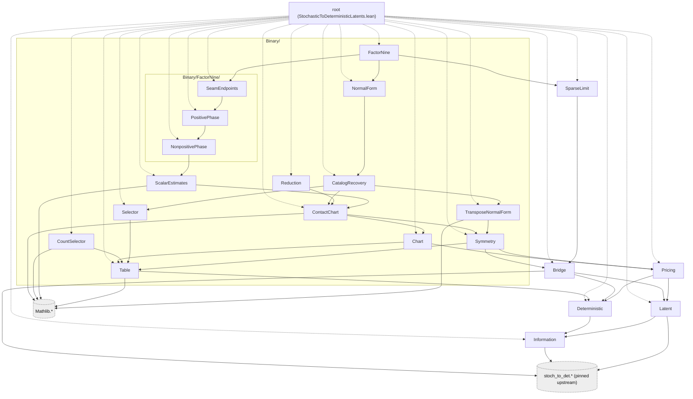

# Lean declaration contracts

The [Verso dependency blueprint](https://AlexisOlson.github.io/stochastic-to-deterministic-latents/)
is deployed from `main`. Its graph links the existing
public declarations and checks their generated status against the claim
ledger; the [nested package](../blueprint/README.md) documents local builds.

This document distinguishes the public Lean API from signatures that remain
targets. Each code block is labelled at its point of use. Existing theorem
signatures omit their proof bodies; they are written in the
`StochasticToDeterministicLatents` namespace and are not standalone programs.
The [current module map](#current-modules-and-admission) links the implemented
layers. The [claim ledger](claims.md) records their mathematical scopes and
evidence tiers.

The contracts use the existing public types:

- `Latent p`, `Latent.score`, and `tau p`;
- `Code α β`, `detScore p g`, and `T p`;
- `w3Cost L g` and `w3 L`; and
- `Binary.RealTable`, `Binary.BinaryCode`, `Binary.catalog`, and
  `Binary.selector`.

Every numerical endpoint quantified directly over a law `p` includes
`IsPMF p`. Structural selector declarations are total on arbitrary real
tables. Conditional pricing takes `L : Latent p`, and chart reduction takes a
chart whose latent supplies its law. Numerical bounds select one attained
optimizer. They do not quantify over every optimizer.

## Pricing and selector interfaces

### `PRICE(c)`

**Existing and audited.** Defined in
[`Pricing.lean`](../StochasticToDeterministicLatents/Pricing.lean):

```lean
theorem T_le_one_add_mul_tau_of_w3
    {p : α × β → ℝ}
    (L : Latent p)
    (hL_optimal : L.score = tau p)
    (c : ℝ)
    (hw3 : w3 L ≤ c * tau p) :
    T p ≤ (1 + c) * tau p
```

The section context supplies `{α β : Type*} [Fintype α] [Fintype β]`
and `[DecidableEq α] [DecidableEq β]`.

The root imports this module, and `Verify.lean` audits the endpoint.

### `BIN-LAW-SELECTOR`

**Existing definitions and audited theorems.** Defined in
[`Binary/Selector.lean`](../StochasticToDeterministicLatents/Binary/Selector.lean):

```lean
noncomputable def Binary.catalog (p : Binary.RealTable) :
    List Binary.BinaryCode

noncomputable def Binary.selector (p : Binary.RealTable) :
    Binary.BinaryCode

theorem Binary.selector_mem_catalog (p : Binary.RealTable) :
    Binary.selector p ∈ Binary.catalog p

theorem Binary.detScore_selector_le_of_mem
    (p : Binary.RealTable) (g : Binary.BinaryCode)
    (hg : g ∈ Binary.catalog p) :
    detScore p (Binary.selector p) ≤ detScore p g
```

**Unimplemented targets.** The backends in
[`Binary/CountSelector.lean`](../StochasticToDeterministicLatents/Binary/CountSelector.lean)
do not yet have these refinement theorems:

```lean
theorem Binary.CountTable.selector_eq_realSelector
    (q : Binary.CountTable) (htotal : 0 < q.total) :
    q.selector = Binary.selector q.realTable

theorem Binary.RationalTable.selector_eq_realSelector
    (q : Binary.RationalTable) :
    q.selector = Binary.selector q.realTable
```

The refinement endpoints use literal code equality because both sides share
the support canonicalization and tie rules. A membership theorem alone does
not establish executable refinement.

## Binary reduction

`Binary.TransposeChart` contains positive component masses $`a,b,c,d`$, their
normalization, the order $`c \le b`$, and a prior `0 < pi ≤ 1/2`. Its public
projections include `law` and `latent`. In the oriented chart,
`cell10` is the high-likelihood-ratio singleton.

### `BIN-REDUCE`

**Existing and audited.** Defined in
[`Binary/Reduction.lean`](../StochasticToDeterministicLatents/Binary/Reduction.lean):

```lean
theorem Binary.TransposeChart.min_chartCodes_le_w3Cost
    (D : Binary.TransposeChart) (g : Binary.BinaryCode) :
    min
        (w3Cost D.latent Binary.constantCode)
        (w3Cost D.latent (Binary.singletonCode Binary.cell10))
      ≤ w3Cost D.latent g
```

`BinaryCode` is the canonical four-label code space. It is taken to represent
every partition of the four observation cells, including partitions originally
written with a larger finite output alphabet. This is a modelling convention
fixing what `Code α β` is taken to represent, not a theorem: no
declaration in this library maps a code into a larger finite alphabet onto a
`BinaryCode`, and `w3Cost` is not defined on any other label type. The
`BIN-REDUCE` endpoint above is therefore kernel-verified over `BinaryCode`
only.

## Binary numerical endpoints

### `BIN-W3-8`

**Existing and audited.** Defined in
[`Binary/FactorNine.lean`](../StochasticToDeterministicLatents/Binary/FactorNine.lean):

```lean
theorem Binary.exists_optimalLatent_w3_le_eight_of_fullSupport
    (p : Binary.RealTable) (hp : IsPMF p) (hpos : ∀ z, 0 < p z) :
    ∃ L : Latent p,
      L.score = tau p ∧
      w3 L ≤ 8 * tau p
```

The delivered endpoint requires full support. The sparse transfer operates
only on `T`.

### `BIN-C9`

**Existing and audited.** Defined in
[`Binary/FactorNine.lean`](../StochasticToDeterministicLatents/Binary/FactorNine.lean):

```lean
theorem Binary.exists_code_detScore_le_nine_mul_tau
    (p : Binary.RealTable) (hp : IsPMF p) :
    ∃ g : Binary.BinaryCode,
      T p ≤ detScore p g ∧
      detScore p g ≤ 9 * tau p
```

**Existing and audited.** The same
[`FactorNine` module](../StochasticToDeterministicLatents/Binary/FactorNine.lean)
proves both endpoints:

```lean
theorem Binary.T_le_nine_mul_tau (p : Binary.RealTable) (hp : IsPMF p) :
    T p ≤ 9 * tau p

theorem Binary.detScore_selector_le_nine_mul_tau_of_fullSupport
    (p : Binary.RealTable) (hp : IsPMF p) (hpos : ∀ z, 0 < p z) :
    detScore p (Binary.selector p) ≤ 9 * tau p
```

The `T` and existential-code endpoints cover every binary law. The named
selector guarantee requires full support. The count and rational refinement
endpoints above remain open, so this guarantee is for the mathematical
real-valued selector.

## Catalog recovery

The full-support proof must keep the selected optimizer and the recovered
catalog code in one existential statement. Two unrelated existence theorems
would not show that the same optimizer satisfies both properties. A theorem
about every optimal latent would be stronger than the mathematical result.

### `BIN-CATALOG-RECOVERY`

**Existing and audited.** Defined in
[`Binary/CatalogRecovery.lean`](../StochasticToDeterministicLatents/Binary/CatalogRecovery.lean):

```lean
theorem Binary.exists_catalogCode_of_contactPresentation
    {p : Binary.RealTable} (hp : IsPMF p) (hpos : ∀ z, 0 < p z)
    (D : SeedSetup p) (K : Clustering D)
    (M : Binary.ContactPresentation p)
    (P : Binary.QuotientPresentation hpos D K M) :
    ∃ g ∈ Binary.catalog p,
      w3 K.quotientSeedSetup.L = w3 M.chart.toTransposeChart.latent ∧
      w3Cost K.quotientSeedSetup.L g =
        w3Cost K.quotientSeedSetup.L
          (Binary.transportCode M.relabel.equiv.symm
            (Binary.phaseSelector M.chart.toTransposeChart)) ∧
      w3Cost K.quotientSeedSetup.L g =
        w3Cost M.chart.toTransposeChart.latent
          (Binary.phaseSelector M.chart.toTransposeChart)
```

A companion theorem, `Binary.exists_catalogCode_of_transposeChartPresentation`,
states the same recovery from a supplied transpose chart. Both are at a
supplied presentation and carry no numerical constant.
[`Binary.NormalForm`](../StochasticToDeterministicLatents/Binary/NormalForm.lean)
constructs such a presentation at the selected optimizer on the two-class
branch, and `Binary.FactorNine` composes the two with the chart cost bound.
That law-quantified composition, with the catalog code kept, is the public
proposition `Binary.SmallCatalogFactorEightWitness`; its inhabitant is private
to `FactorNine`, and the public headline
`Binary.exists_optimalLatent_w3_le_eight_of_fullSupport` is its weakening
through `w3_le_w3Cost`. A public theorem restating the private witness would
be a "make public" task, not a proof task, and no row asks for it.

## Binary stochastic optimum

The four rows `BIN-CONSTANT-TEST`, `BIN-TWO-COMPONENTS`, `BIN-TAU-EXACT`,
and `BIN-DISAGREEMENT-BAND` are `paper proof` in the
[binary stochastic optimum](binary-stochastic-optimum.md) page. No public
declaration states any of them.

**Existing declarations the proofs rest on.** `latent_score_eq` (the score
decomposition), `exists_optimalLatent` (attainment), `tau_le_score`, and
`Latent.ofFunction_score_eq_detScore`, all in
[`Bridge.lean`](../StochasticToDeterministicLatents/Bridge.lean) and
[`Latent.lean`](../StochasticToDeterministicLatents/Latent.lean). The
binary marginals `Binary.rowMarginal` and `Binary.columnMarginal` are defined
in [`Binary/TransposeNormalForm.lean`](../StochasticToDeterministicLatents/Binary/TransposeNormalForm.lean).

**Unimplemented targets.** The quantities $`A, E, V, M`$ and the cubic are new
definitions; the signatures below name them without fixing their placement.

```lean
noncomputable def Binary.normA (p : Binary.RealTable) : ℝ
noncomputable def Binary.normE (p : Binary.RealTable) : ℝ
noncomputable def Binary.normV (p : Binary.RealTable) : ℝ
noncomputable def Binary.normM (p : Binary.RealTable) : ℝ

theorem Binary.tau_eq_mutualInfo_iff_constantTest
    (p : Binary.RealTable) (hp : IsPMF p)
    (hrow : ∀ i, 0 < Binary.rowMarginal p i)
    (hcol : ∀ j, 0 < Binary.columnMarginal p j) :
    tau p = mutualInfo Prod.fst Prod.snd p ↔
      0 ≤ Binary.normA p ∧ 0 ≤ Binary.normE p ∧
        Binary.normV p ^ 3 ≤ Binary.normA p * Binary.normE p * Binary.normM p

theorem Binary.optimalLatent_two_components
    {p : Binary.RealTable} (hp : IsPMF p) (L : Latent p)
    (hL : L.score = tau p) :
    ∃ q₁ q₂ : Binary.RealTable,
      ∀ v, L.prior v ≠ 0 → L.comp v = q₁ ∨ L.comp v = q₂

noncomputable def Binary.cubicRoot (p : Binary.RealTable) : ℝ

theorem Binary.tau_eq_of_constantBranch
    (p : Binary.RealTable) (hp : IsPMF p)
    (hdet : 0 < p (0, 0) * p (1, 1) - p (0, 1) * p (1, 0))
    (hle : Real.sqrt (p (0, 0) * p (1, 1)) ≤ Binary.cubicRoot p) :
    tau p = mutualInfo Prod.fst Prod.snd p

theorem Binary.tau_eq_of_mixedBranch
    (p : Binary.RealTable) (hp : IsPMF p)
    (hdet : 0 < p (0, 0) * p (1, 1) - p (0, 1) * p (1, 0))
    (hlt : Binary.cubicRoot p < Real.sqrt (p (0, 0) * p (1, 1))) :
    tau p = Psi p - Phi (Binary.swapContact p)

theorem Binary.tau_eq_mutualInfo_of_disagreementBand
    (p : Binary.RealTable) (hp : IsPMF p)
    (h1 : 1 / 3 ≤ p (0, 1) + p (1, 0)) (h2 : p (0, 1) + p (1, 0) ≤ 2 / 3) :
    tau p = mutualInfo Prod.fst Prod.snd p
```

`Binary.swapContact p` denotes the component $`q^+`$ of the page; its
definition requires `Binary.cubicRoot`, which is the largest nonnegative root
of $`u^3 - (b+c)u^2 - bcu - bc(a+d)`$. A definition of the
root by `Classical.choose` from an existence lemma is acceptable; the theorems
do not require it to be computable.

**A formalization route.** The two-contact chart of
[`Binary/NormalForm.lean`](../StochasticToDeterministicLatents/Binary/NormalForm.lean)
already carries the cubic. Its `contact_root_identity`,

```math
(1 + x^2 + x^4)\,A_0\,D_0 = x^4\,(x^2 - A_0 - D_0),
```

is, after the $`Y`$-label exchange that orients the chart's determinant positive,
the statement $`f_p(u_0) = 0`$ with $`u_0 = x^2 \text{/} Q`$ and
$`Q = 1 + x^4 + A_0 + D_0`$: substituting the exchanged chart law into the
cubic and clearing $`Q^3`$ gives
$`x^4\,(x^2 - A_0 - D_0) - (1 + x^2 + x^4)\,A_0\,D_0`$, the identity with its
two sides subtracted. This is an identity check, not a theorem of the library.
It suggests proving `Binary.tau_eq_of_mixedBranch` on full support by
identifying the selected optimizer's chart with the diagonal-swap pair, and
proving the constant branch through the rational test. The sparse cases need
the support-face argument of the page, which the library's full-support seed
setup does not supply.

## Arbitrary finite alphabets

These declarations remain conjectural.

### `GEN-W3-8`

**Conjectural target.** No public declaration proves this estimate.

```lean
theorem exists_optimalLatent_w3_le_eight
    {α β : Type*}
    [Fintype α] [Fintype β]
    [DecidableEq α] [DecidableEq β]
    (p : α × β → ℝ) (hp : IsPMF p) :
    ∃ L : Latent p,
      L.score = tau p ∧
      w3 L ≤ 8 * tau p
```

### `GEN-C9`

**Conjectural target.** No public declaration proves this arbitrary-alphabet
bound.

```lean
theorem T_le_nine_mul_tau
    {α β : Type*}
    [Fintype α] [Fintype β]
    [DecidableEq α] [DecidableEq β]
    (p : α × β → ℝ) (hp : IsPMF p) :
    T p ≤ 9 * tau p
```

No selector function is part of either general contract.

## External lower bound

`LOWER-1960` has no local declaration contract. The result remains a citation
to the external theorem
`StochToDet1960.exists_lower_bound_1960073002187`. This repository will add a
wrapper only if it imports or independently reproduces that
certificate. Such a wrapper must retain the external `native_decide`
qualification.

## Current modules and admission

The [root module](../StochasticToDeterministicLatents.lean) imports all modules
in this table. Their public theorems are audited in
[`Verify.lean`](../Verify.lean). The table groups them by mathematical role.

| Role | Modules | Result supplied |
|---|---|---|
| Finite information and latent objectives | [Information](../StochasticToDeterministicLatents/Information.lean), [Latent](../StochasticToDeterministicLatents/Latent.lean), [Deterministic](../StochasticToDeterministicLatents/Deterministic.lean), [Bridge](../StochasticToDeterministicLatents/Bridge.lean) | Objectives, finite deterministic minima, stochastic attainment, and contact setup |
| Binary tables and selectors | [Table](../StochasticToDeterministicLatents/Binary/Table.lean), [Selector](../StochasticToDeterministicLatents/Binary/Selector.lean), [CountSelector](../StochasticToDeterministicLatents/Binary/CountSelector.lean) | Mathematical selector and executable definitions; refinement remains open |
| Pricing | [Pricing](../StochasticToDeterministicLatents/Pricing.lean) | Exact pricing identity and `PRICE(c)` |
| Relabeling and charts | [Symmetry](../StochasticToDeterministicLatents/Binary/Symmetry.lean), [Chart](../StochasticToDeterministicLatents/Binary/Chart.lean), [ContactChart](../StochasticToDeterministicLatents/Binary/ContactChart.lean) | Transport, transpose chart, and strict determinant gap |
| Selected optimizer | [TransposeNormalForm](../StochasticToDeterministicLatents/Binary/TransposeNormalForm.lean), [NormalForm](../StochasticToDeterministicLatents/Binary/NormalForm.lean) | Unary or contact presentation of a selected optimal quotient |
| Catalog witness | [CatalogRecovery](../StochasticToDeterministicLatents/Binary/CatalogRecovery.lean) | A literal law-catalog code with the chart-selected cost |
| Scalar estimates | [ScalarEstimates](../StochasticToDeterministicLatents/Binary/ScalarEstimates.lean) | One-variable inequalities used by the analytic phases |
| Nonpositive arm | [FactorNine.NonpositivePhase](../StochasticToDeterministicLatents/Binary/FactorNine/NonpositivePhase.lean) | The nonpositive scalar bound |
| Positive arm | [FactorNine.PositivePhase](../StochasticToDeterministicLatents/Binary/FactorNine/PositivePhase.lean) | The positive scalar bound conditional on seam positivity |
| Seam closure | [FactorNine.SeamEndpoints](../StochasticToDeterministicLatents/Binary/FactorNine/SeamEndpoints.lean) | Both seam endpoints and `ContactChart.strictFactorEight` |
| Boundary transfer | [SparseLimit](../StochasticToDeterministicLatents/SparseLimit.lean) | A generic bound on `T` from its full-support premise |
| Binary factor nine | [FactorNine](../StochasticToDeterministicLatents/Binary/FactorNine.lean) | Full-support `BIN-W3-8` and selector bound; all-law `BIN-C9` |
| Separate code reduction | [Reduction](../StochasticToDeterministicLatents/Binary/Reduction.lean) | `BIN-REDUCE` over the canonical `BinaryCode` space |

The import graph of the library, generated from the `import` lines by
`scripts/gen_diagrams.py` (an edge from A to B means A imports B; the root
module imports every module and is not drawn):



`Binary.FactorNine` imports `SeamEndpoints`, `NormalForm`, and `SparseLimit`.
It applies the closed chart estimate to the selected optimizer, recovers a
catalog witness, and uses pricing and the sparse transfer. The separate
`Binary.Reduction` theorem is not a dependency of this upper bound. Neither
scalar arm alone states the factor-eight theorem for an optimal latent.

The [admission record](../verification/admissions.md) contains the curated
history, declaration counts, and discovered axiom sets. New declarations must
pass the [admission checks](../verification/README.md) before entering the
root. `General` remains absent; no target signature may be added as an
`axiom` or an admitted placeholder.
